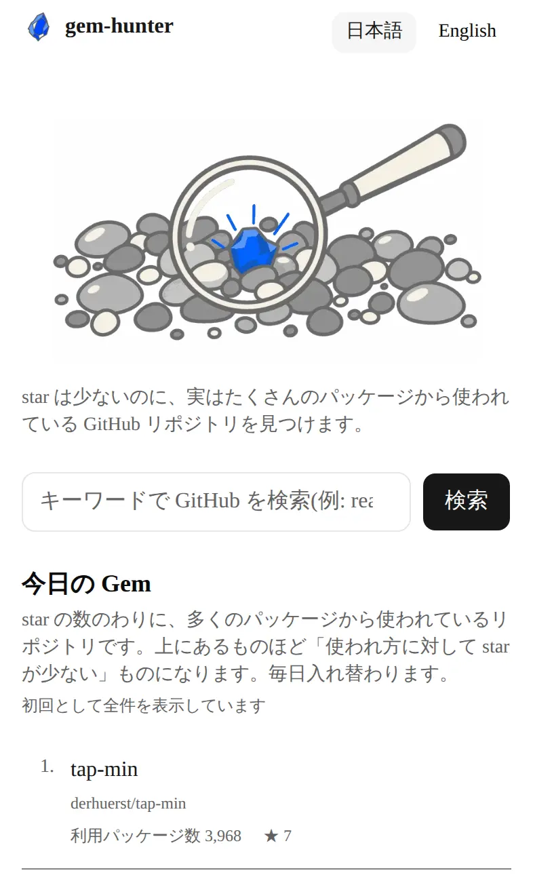
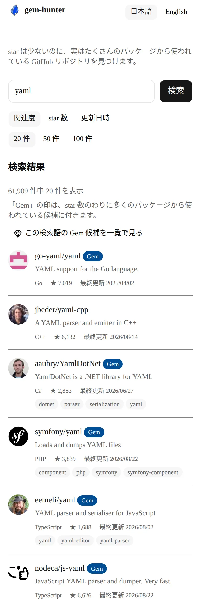
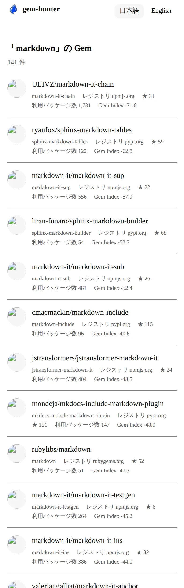
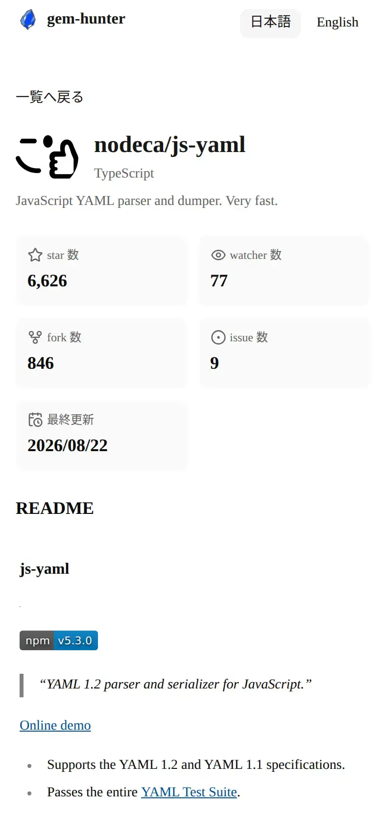

# gem-hunter

star の多さでは埋もれてしまう「実際に使われている OSS」を、個人開発者が見つけられるようにする検索プラットフォーム。

キーワードで GitHub のリポジトリを検索して詳細（統計・README）を読める。トップページのキーワード未入力の状態では、検索結果の代わりに **star の数のわりに多くのパッケージから使われている** リポジトリを日次で入れ替わるダイジェスト「今日の Gem」として並べる。検索結果では同じ観点で選ばれたリポジトリに **Gem バッジ** が付き、そのキーワードの Gem 候補だけを集めた一覧（`/{locale}/gems`）へそのまま移動できる。日本語・英語に対応し、アカウント登録なしで全機能を使える。

- **使ってみる**: <https://gem-hunter.kinamocchi-tech.workers.dev/ja>（[English](https://gem-hunter.kinamocchi-tech.workers.dev/en)）
- **紹介ページ**（スクリーンショット・できること・FAQ）: <https://kai-kou.github.io/gem-hunter/>（ソースは [`site/`](./site)）

> ✅ **[与件](./docs/02_requirements/minimum-requirements.md)（受け入れ基準 §7・全 11 項目）を全件充足**（[充足チェックリスト](./docs/02_requirements/minimum-requirements-checklist.md)・❌ 0 件）。手元確認: `npm ci && npm test && npm run test:e2e`（上記「使ってみる」と同じ本番で確認可）。🔵 Gem Index・OAuth・多言語対応は与件外の上乗せ（冒頭「本要件を満たしたうえで段階的に追加する」に基づく）。

> **この README で分かること**: [画面](#画面) / [動かし方](#開発ローカル) / [環境変数](#環境変数) / [技術スタック](#技術スタック) / [設計上の判断](#設計上の判断) / [AI の利用範囲](#ai-を利用した範囲と方法nfr-31) / [ADR 一覧](#技術的意思決定の記録adr)

> 旧称: IndieGems（[`Q-12`](./docs/02_requirements/open-questions.md) により `gem-hunter` に統一）

## 画面

スマートフォン幅（本番環境・日本語ロケール）の実画面。PC 幅を含む紹介は[紹介ページ](https://kai-kou.github.io/gem-hunter/)を参照。

| 今日の Gem（キーワード未入力のトップ）                                                                                                                                                                                                                                                                                                                                                                                                                                   | 検索結果（`yaml` で検索）                                                                                                                                                                                                                                                                                                                                                                                                                                                                           |
| ------------------------------------------------------------------------------------------------------------------------------------------------------------------------------------------------------------------------------------------------------------------------------------------------------------------------------------------------------------------------------------------------------------------------------------------------------------------------ | --------------------------------------------------------------------------------------------------------------------------------------------------------------------------------------------------------------------------------------------------------------------------------------------------------------------------------------------------------------------------------------------------------------------------------------------------------------------------------------------------- |
|  |  |

| 検索語を引き継いだ Gem 一覧                                                                                                                                                                                                                                                                                                                                                                                                                                                                                  | リポジトリ詳細                                                                                                                                                                                                                                                                                                                                                                  |
| ------------------------------------------------------------------------------------------------------------------------------------------------------------------------------------------------------------------------------------------------------------------------------------------------------------------------------------------------------------------------------------------------------------------------------------------------------------------------------------------------------------ | ------------------------------------------------------------------------------------------------------------------------------------------------------------------------------------------------------------------------------------------------------------------------------------------------------------------------------------------------------------------------------- |
|  |  |

## 開発（ローカル）

Node.js 22 以上が必要（wrangler 4.x の要件）。

```bash
npm ci
npm run dev          # http://localhost:3000 で検索画面が開く
npm run build        # 本番ビルド（Next.js）
npm start            # ビルド済みのアプリを起動
npm test             # ユニット・結合テスト（Vitest）
npm run test:watch   # 同上（ウォッチモード）
npm run test:e2e     # E2E テスト（Playwright。スタブ API + アプリを自動起動、外部ネットワーク非依存）
npm run lint         # ESLint
npm run format       # Prettier（書き換える。検証だけなら npm run format:check）
npm run check        # PR 前の一括チェック（tools/run_checks.sh）
```

Cloudflare Workers 向けのビルドとデプロイは別系統のコマンドになる。

```bash
npm run preview:build    # Workers 向けビルド（opennextjs-cloudflare build）
npm run preview:upload   # ビルドして wrangler versions upload（PR 用の固定 URL には --preview-alias pr-<N> が要る。下の「デプロイ経路」を参照）
npm run deploy           # ビルドして wrangler deploy（本番。コミット SHA を --tag に付ける）
npm run cf-typegen       # wrangler types（CloudflareEnv の型を生成する）
```

`npm test` / `npm run test:e2e` は環境変数を一切設定しなくても通る（外部 API はモック化されている）。

`npm run check`（[`tools/run_checks.sh`](./tools/run_checks.sh)）は Lint・型チェック・Vitest・Playwright・**Lighthouse Accessibility=100 ゲート**（[`D-25`](./docs/02_requirements/open-questions.md)）・リポジトリ固有の機械検査 30 本超（層の依存規則・配色コントラスト・UI 寸法・ADR 索引・CJK Markdown 記法など）をまとめて実行し、結果を Markdown の表で出力する。品質チェック・デプロイには GitHub Actions を使わず（[`D-23`](./docs/02_requirements/open-questions.md)）、この結果表を PR 本文に貼ることが PR 前の唯一の機械的証跡になっている（Actions は [`gem-pool-refresh.yml`](./.github/workflows/gem-pool-refresh.yml) による Gem 候補プールの日次生成・週次反映にのみ使用）。

### デプロイ経路

| 対象                                                         | 経路                                                                                                                                                                                                                                                                                                                                                                               |
| ------------------------------------------------------------ | ---------------------------------------------------------------------------------------------------------------------------------------------------------------------------------------------------------------------------------------------------------------------------------------------------------------------------------------------------------------------------------- |
| **本番**（`https://gem-hunter.kinamocchi-tech.workers.dev`） | `main` への push を Cloudflare の **Workers Builds**（Git 連携）が拾ってビルド・デプロイする（[`D-31`](./docs/02_requirements/open-questions.md)）。デプロイゲートが閉じていた分は自動で再試行されないため、ゲート通過を契機に [`tools/trigger_workers_build.py`](./tools/trigger_workers_build.py) で明示的に再ビルドを起こす。セッションからの `npm run deploy` はフォールバック |
| **PR プレビュー**                                            | `npm run preview:upload` 相当（`wrangler versions upload --preview-alias pr-<N>`）で PR ごとの URL を作り、PR 本文に貼る（`SD-1`）。スプリントレビューの受け入れ後に退役させる                                                                                                                                                                                                     |
| **紹介ページ（LP）**                                         | `site/` を `gh-pages` ブランチのルートへ同期して GitHub Pages で配信する（[`D-35`](./docs/02_requirements/open-questions.md)・手順の正本は [`site/README.md`](./site/README.md)）。アプリ本体とは別レーンにして、LP の更新が本番アプリのデプロイゲートに影響しないようにしている                                                                                                   |

本番と PR プレビューの手順・ゲート判定の正本は [Cloudflare インフラ設計](./docs/03_design/infrastructure/cloudflare-infrastructure.md) §8.2（LP の同期手順は上表のとおり [`site/README.md`](./site/README.md) が持つ）。

### 環境変数

すべて **任意**。1 つも設定しなくても `npm run dev` は起動し、検索・詳細表示は動作する（その場合 GitHub API を未認証で叩くためレート枠が狭くなる）。リポジトリ直下の `.env.example` に全変数のひな形（実値なし）を置いてあるので、`cp .env.example .env.local` してから以下の表を参照して必要な分だけ値を入れる（`.env.local` は Next.js の規約どおり追跡対象外）。`.env.example` には `SITE_URL=`（空欄）のまま置いてあり、未設定・空文字のいずれも本番 URL へフォールバックする（下表を参照）。

| 変数                           | 用途                                                                                                                                                                                                                                                                         | 未設定時の挙動                                                                                                                                                                                                                                                                                                                       |
| ------------------------------ | ---------------------------------------------------------------------------------------------------------------------------------------------------------------------------------------------------------------------------------------------------------------------------- | ------------------------------------------------------------------------------------------------------------------------------------------------------------------------------------------------------------------------------------------------------------------------------------------------------------------------------------ |
| `GITHUB_APP_CLIENT_ID`         | GitHub App の installation token 取得（[ADR 0003](./docs/adr/0003-github-app-authentication.md)）                                                                                                                                                                            | 3 変数が揃わない限り未認証で GitHub API を叩く（レート枠が狭い）                                                                                                                                                                                                                                                                     |
| `GITHUB_APP_INSTALLATION_ID`   | 同上                                                                                                                                                                                                                                                                         | 同上                                                                                                                                                                                                                                                                                                                                 |
| `GITHUB_APP_PRIVATE_KEY_PKCS8` | 同上（**PKCS#8 形式** で注入する必要がある）                                                                                                                                                                                                                                 | 同上                                                                                                                                                                                                                                                                                                                                 |
| `GITHUB_OAUTH_CLIENT_ID`       | 任意ログイン（[ADR 0012](./docs/adr/0012-optional-github-oauth.md)）                                                                                                                                                                                                         | 下記 `SESSION_ENCRYPTION_KEY` を含む **4 変数が揃わない限り** ログイン導線が静かに無効化される（未ログイン相当の機能はすべて動く）                                                                                                                                                                                                   |
| `GITHUB_OAUTH_CLIENT_SECRET`   | 同上                                                                                                                                                                                                                                                                         | 同上                                                                                                                                                                                                                                                                                                                                 |
| `GITHUB_OAUTH_CALLBACK_URL`    | 同上（デプロイ先ごとに異なる。オープンリダイレクト対策の検証にも使う）                                                                                                                                                                                                       | 同上                                                                                                                                                                                                                                                                                                                                 |
| `SESSION_ENCRYPTION_KEY`       | ログイン後のセッション Cookie 暗号化鍵（32 バイトを base64url エンコードした値）                                                                                                                                                                                             | 同上（**本行だけが欠けても** ログイン導線ごと無効化される。表示可否は `src/composition/auth.ts` の `isAuthConfigured()` が 4 変数の AND で判定する）                                                                                                                                                                                 |
| `RATE_LIMIT_SALT`              | 自リクエスト間引き（`NFR-7`）でクライアント IP を HMAC 化する際の salt。適用範囲は検索（`/{locale}` / `GET /api/search`）と Gem 一覧（`/{locale}/gems`）。適用経路の正本は [Cloudflare インフラ設計](./docs/03_design/infrastructure/cloudflare-infrastructure.md) §3.3 の表 | **適用経路すべてで** 間引きをしない（フェイルオープン。エラーにも `429` にもならず通す）。ローカル実行は Workers の `RATE_LIMITER` binding が無いため完全に無音、Workers 上で binding があるのに salt だけ無い場合は設定不備として警告ログを 1 行だけ残す                                                                            |
| `SITE_URL`                     | OG 画像の相対 URL を絶対 URL へ解決するサイトの正準オリジン（`app/[locale]/layout.tsx` の `metadataBase`）                                                                                                                                                                   | 本番 URL へフォールバックするため通常は設定不要。🔴 **ビルド時変数** であり、ビルド後にランタイム側で変えても反映されない。空文字・空白のみ（`SITE_URL=` / `SITE_URL=   `）も未設定と同じ扱いでフォールバックする（`getSiteUrl()` は `?.trim() || デフォルト値` で判定・Issue #489） |

🔵 公開中の本番環境には OAuth の 4 変数を供給していないため、現在ログイン導線は表示されない（未ログインで全機能が使える状態）。

上記のうち **秘匿情報（GitHub App の秘密鍵・OAuth シークレット・セッション暗号鍵）は `src/infrastructure/` 配下だけが `process.env` から読む**（秘匿情報を読んでよい層を外周 1 層に閉じる設計・`ARCH-5` / `NFR-22`）。秘匿でない運用パラメータ 2 つ（`RATE_LIMIT_SALT` / `SITE_URL`）は、依存を組み立てる composition root（[`src/composition/rate-limit.ts`](./src/composition/rate-limit.ts) / [`src/composition/site-url.ts`](./src/composition/site-url.ts)）が読む。`GITHUB_API_ORIGIN` と `GITHUB_OAUTH_ORIGIN` はテスト専用のスタブ切替であり（ループバック宛てのみ有効）、アプリの実行時には使わない。

### 技術スタック

| 領域           | 採用                                                                                                                                                |
| -------------- | --------------------------------------------------------------------------------------------------------------------------------------------------- |
| フレームワーク | Next.js 16（App Router・React Server Components・[ADR 0006](./docs/adr/0006-nextjs16-app-router.md)）と、それが要求する React 19                    |
| UI             | Tailwind CSS v4 + shadcn/ui（Radix UI・[ADR 0001](./docs/adr/0001-ui-stack.md)）                                                                    |
| 実行環境       | Cloudflare Workers（`@opennextjs/cloudflare`。本番・プレビュー配信の詳細は [ADR 0002](./docs/adr/0002-cloudflare-workers-infrastructure.md)）       |
| テスト         | Vitest 4 + Testing Library + MSW 2（ユニット・結合）/ Playwright + axe（E2E）（[テスト戦略](./docs/04_development/testing-strategy.md)）            |
| 主要ライブラリ | `zod`（外部レスポンスと入力の検証）/ `sanitize-html`（README の HTML を描画する前の無害化）/ `jose`（セッション Cookie の暗号化）                   |
| データ         | 永続ストアなし。GitHub REST / Search API を直参照し、Gem Index だけ静的 JSON を配信（[ADR 0007](./docs/adr/0007-no-database-client-side-state.md)） |

層と依存規則は [アプリケーションアーキテクチャ](./docs/03_design/architecture/application-architecture.md) が正本（`python3 tools/check_architecture_boundaries.py` で機械検証する）。ドメインの用語（ユビキタス言語）は [ドメインモデル](./docs/03_design/data-model/domain-model.md) が正本。

## ドキュメント

プロジェクトのドキュメントは [`docs/`](./docs) 配下で管理する。構成の詳細は [`docs/README.md`](./docs/README.md) を参照。

- **要件定義書（正本）**: [`docs/02_requirements/prd.md`](./docs/02_requirements/prd.md)
- 決定ログ・論点リスト: [`docs/02_requirements/open-questions.md`](./docs/02_requirements/open-questions.md)
- 与件（最低要件定義）: [`docs/02_requirements/minimum-requirements.md`](./docs/02_requirements/minimum-requirements.md)
- ミッション・KPI: [`docs/project-mission.md`](./docs/project-mission.md)
- 初期コンセプト: [`docs/00_concept/initial-concept.md`](./docs/00_concept/initial-concept.md)

## 設計上の判断

> 与件（[`minimum-requirements.md`](./docs/02_requirements/minimum-requirements.md) §6）が求める「設計上の判断・工夫した点」を記載する。各項目の全文と経緯は [決定ログ](./docs/02_requirements/open-questions.md)（`D-n`）を参照。

### Hidden Gem を「被依存数に対する star の残差」と定義した（`ADR 0009`）

「知られざる良質な OSS」を測るために独自の合成スコア（保守性・ドキュメント品質・依存シグナルの加重和）を作る構想から出発したが、**作らない** ことにした。

- **1 行で言える定義に絞った**: Gem とは「実際に使われている度合い（被依存数）に対して、注目度（star 数）が不釣り合いに小さいリポジトリ」。`Gem Index` は **被依存数のパーセンタイル順位 − star のパーセンタイル順位** という残差で、重みを持たないぶん「なぜこの順位なのか」を利用者に説明できる
- **健全性は自作しない**: 保守されているかの判定は OpenSSF `criticality_score` / Scorecard に委ね、被依存数は Ecosyste.ms のオープンデータに委ねる。自作すると既存スコアの再実装になり、重み・正規化・再計算頻度が未定のままでは受け入れ条件が書けなかった
- **2 軸を合算しない**: 過小評価度は「並び順」、健全性は「足切り」と役割を分け、1 つの数値に混ぜない
- **効いている範囲を広げない**: 検索結果への適用は一度 **撤去した**（候補プールの被覆率が足りなかった・[`D-33`](./docs/02_requirements/open-questions.md)）が、母集団を 12 レジストリ・約 11 万リポジトリへ拡大した実測を受けて [`D-36`](./docs/02_requirements/open-questions.md) で **再導入した**（汚染フィルタとリポジトリ単位の重複排除を通した後の配信プールは 12 レジストリ・62,483 リポジトリ・[`D-37`](./docs/02_requirements/open-questions.md)）。現在この指標が効くのは ① 日次ダイジェスト「今日の Gem」の並び順 ② 検索結果カードの **Gem バッジ**（並び順は変えない注釈・`SP-18`） ③ 検索語を引き継いだ **Gem 候補の一覧**（`/{locale}/gems` の並び順・`SP-19`）の 3 経路。🔴 **`sort=gem-index`（検索結果そのものの主ソート軸）は復活させていない** — 実測で検索上位 100 件中 68 件に値が無く、値の無い結果に順位を与えられないため（`D-36`）。パーセンタイルの母集団定義・しきい値・配信件数は **意図的に未確定のまま** で、実データを見てから決める（[ADR 0009](./docs/adr/0009-hidden-gem-score-definition.md) §2.3）

検討した代替案と却下理由は [ADR 0009](./docs/adr/0009-hidden-gem-score-definition.md) に記録している。

### サーバー側にデータベースを持たず、状態はクライアント側に置いた（`ADR 0007`）

GitHub API を直接参照する構成にして、**サーバー側の永続ストア（DB・KV・Durable Objects）を一切持たない**。インスタンスは使い捨て前提で、プロセス内メモリにも状態を残さない（例外は TTL 付きで失っても正しさが壊れないキャッシュだけ・[ADR 0005](./docs/adr/0005-cache-port-yagni-exception-and-ttl.md)）。

- **鮮度の問題が消える**: 自前 ETL + DB にすると「いつ同期したデータか」を利用者に説明する責任が生まれる。直参照ならデータは常に GitHub の現在値で、同期ジョブも整合性の設計も要らない
- **捨てたものも明示してある**: 全文検索・独自の集計・レスポンスの安定性は諦めた。代わりにレート枠と上流障害への耐性（キャッシュ・エラー種別の出し分け）に投資している
- **状態は URL・Cookie・`localStorage` に振り分けた**: 検索条件は URL（共有・戻る操作が壊れない）、ロケールは Cookie、既読のダイジェストは `localStorage`。「サーバーに持たない」を MVP の都合ではなく設計原則へ格上げした（`D-5` 追補）

### エラーを 7 種に判別して、種類ごとに違う言葉で伝える（`prd.md` §7）

「読み込みに失敗しました」で終わらせない。[`src/domain/errors.ts`](./src/domain/errors.ts) の `ErrorKind` が **`network` / `rateLimitPrimary` / `rateLimitSecondary` / `auth` / `validation` / `notFound` / `upstream` の 7 種** を型で表し、層をまたいでこの種別だけを持ち回る。

- **利用者に出すのは種別から引いた i18n 文言だけ**。例外の `message` は開発者向けのログに留め、内部情報を画面や API 応答へ流さない
- 一次レート制限は `x-ratelimit-reset` から復帰時刻を、二次レート制限は `retry-after` から再試行までの秒数を出す。**「待てば直る」のか「入力が悪い」のかが画面で区別できる** ことを目標にした
- 種別ごとに専用のイラストと文言を用意し、E2E テストで出し分けを固定している

### Gem Index の母集団と配信の作り方（`D-37` / `D-38`）

Gem Index が「説明できる指標」であるためには、順位の母集団が偏っていないことが前提になる。

- **レジストリ別に成層化する**: 12 レジストリそれぞれから被依存数の降順で同数（既定 15,000 件）を取る固定枠にした。母数比例にすると npm が枠の大半を占め、「1 レジストリの中の相対順位」に戻ってしまう
- **汚染を落としてから数える**: チュートリアル・テンプレート・ミラーの類を除外し、同一リポジトリを指す複数パッケージはリポジトリ単位で重複排除する。この 2 段を通した後の配信プールの件数は前掲（[Hidden Gem の定義](#hidden-gem-を被依存数に対する-star-の残差と定義したadr-0009)）のとおり
- **配信はレジストリ別シャードの静的アセット**: DB を持たない原則を崩さずに 6 万件を引くため、レジストリごとに分割した静的 JSON を isolate の cold start で並列取得して単一の `Map` にまとめ、以降はメモリ上で join する（[`src/infrastructure/platform/static-gem-index.ts`](./src/infrastructure/platform/static-gem-index.ts)）。初期化は singleton promise にして、cold start が重なっても取得が多重化しないようにした

### 発見面と一覧の見せ方を「有限」で区切った（`ADR 0014` / `ADR 0008`）

「今日の Gem」も検索結果も、**無限に流さず有限で区切る** という同じ判断で作っている。

- **今日の Gem は日次・5 件で打ち切る**: 無限フィードにすると「今日はここまで」という区切りが消え、Hidden Gem の希少性という価値提案が埋没する。並び順は **UTC の日付文字列を唯一のシードとする決定論的生成** で、同じ日は誰が見ても同じ並びになり、リロードしても再現する。サーバー側にリクエストごとの状態を持たないので、エッジキャッシュとも両立する（[ADR 0014](./docs/adr/0014-zero-query-daily-digest.md)）
- **検索結果は無限スクロールを採らずページネーションにした**: 与件はどちらでもよいとしていたが、自分で課した a11y と URL 状態の方針に合う側を選んだ。無限スクロールだとキーボードでページ末尾に到達できず、スクリーンリーダーに「157 件中 26〜50 件」のような現在位置を提示できず、詳細から戻ったときの位置復元も「どこまで読み込んでいたか」の再現が要る。ページネーションなら **ページ番号という 1 つの離散値を URL に置くだけ** で全部が解ける（[ADR 0008](./docs/adr/0008-pagination-over-infinite-scroll.md)）

### 画像の最適化に `next/image` を使わない（`INF-11`）

検索結果には 1 画面あたり数十個のオーナーアイコンが並ぶ。ここで `next/image` の最適化を通すと、変換枠の消費が件数に比例して膨らみ、コストが読めなくなる。

- 代わりに **GitHub 側のサイズパラメータ**（一覧は `?s=80`、詳細は `?s=128`）で必要な解像度だけを取り、`width` / `height` を明示して CLS を防ぎ、一覧では `loading="lazy"` を付ける
- 副次的な効果として、画像を自前で再配信しないため GitHub 利用規約上の整理も単純になった（[ADR 0013](./docs/adr/0013-public-operation-under-github-terms.md)）
- 「最適化の手段としてフレームワーク標準を採らなかった」判断なので、要件を落としたのではないことを明示しておく

### 機械ゲートにするのはアクセシビリティだけにした（`D-25`）

`npm run check` は Lighthouse の **Accessibility = 100 を満たさなければ落ちる**。一方で Performance はスコアを計測・記録するだけで、閾値を持たせていない。

- 性能は回線・上流 API の応答時間に左右されて数値が揺れる。揺れる指標をゲートにすると、無関係な赤で開発が止まり、やがて誰も見なくなる
- アクセシビリティは決定論的に測れて、落ちたら実際に使えない人が出る。**止める価値がある方だけを止める**
- 🔴 ただし Lighthouse が 100 でも a11y が担保されたとは考えていない（`:focus-visible` のコントラストなど axe-core が検出できない領域がある）。Playwright + axe による E2E と目視の確認を併走させている

### i18n を `next-intl` に頼らず自前で実装した（`ADR 0011`）

日英切替は当初 `next-intl` を第一候補にしていたが、実装着手時の一次確認で不採用にした。Next.js 16 の `proxy.ts` は既定で Node.js ランタイム固定になり、ランタイムを上書きすることもできないため、Cloudflare Workers（Edge 実行）のアダプタと両立しない。

- ロケールはパス（`/ja` / `/en`）で表し、未指定のアクセスは `next.config.ts` の `redirects()` で既定ロケールへ送る（middleware を使わない）
- メッセージは `messages/{locale}.json` の素の JSON で、キー構造の一致をテストで固定している
- ライブラリを 1 つ減らしたことで、`NFR-21`（特定 PaaS 固有機能への依存を最小化する）とも素直に両立した

### リリースサイクル: 常設の dev 環境を持たない（`D-21`）

デプロイは **PR ごとのプレビュー環境**（Cloudflare Workers の version + preview alias）と **`main` = 本番** の 2 つだけで構成し、「dev ブランチ = 常設プレビュー環境」を **意図的に置いていない**。

- **dev を置いても検証が増えない**: 本プロジェクトは単一開発者 + AI の自律ルーティンで開発が自走するため、dev を確認する人間がいない。dev には実トラフィックも通らないため、PR 時点で通過済みのチェックと同じ検証をもう一度走らせるだけの環境になる。得られるのはリードタイムの増加と、「誰が・いつ dev → `main` へ昇格させるか」という新しい判断点だけになる
- **本番直結のリスクは別の手段で塞ぐ**: 複数 PR を積み上げた「合成状態」が本番で初めて動くリスクは実在する。これは dev を挟んでも（昇格の判断主体が未定義な限り）同じ問いが 1 段上に移動するだけなので、**`main` マージ後の HEAD であらためて `npm run check` を走らせ、通らなければ本番デプロイに進ませないゲート** で塞ぐ。GitHub Actions が使えない現在（[`D-23`](./docs/02_requirements/open-questions.md)）はこのゲートを CI ではなくセッションが実行しており、`npm run check` の通過に加えて [`tools/check_deploy_gate.py`](./tools/check_deploy_gate.py) が「判定未確定のスプリント成果物が `main` に載っていないか」を確認してから本番ビルドを起こす（判定不能なら出さない fail-closed。手順の正本は [Cloudflare インフラ設計](./docs/03_design/infrastructure/cloudflare-infrastructure.md) §8.2）
- **将来の追加を判断する条件も決めてある**: 方針そのものは確定済みで、`M-4`（第三者へ公開するかの判断ゲート・[`roadmap.md`](./docs/02_requirements/roadmap.md)）の時点で **追加導入の要否だけ** を判断する。対象は OAuth 経路の事前検証用環境（プレビューは PR ごとに URL が変わりコールバック URL を登録できない）と、段階的デプロイの 2 つ
  - ✅ **判定済み（2026-08-24）**: **いずれも追加しない**。OAuth 検証用環境は、検証対象のログイン機能が本番でも公開されておらず与件外の上乗せであるため（`D-44`）。段階的デプロイは、実利用者がまだ居らず段階展開の母数が無いうえ、全自動のデプロイ経路に昇格判断者という未定義の判断点を持ち込むため（`D-45`）。いずれも再検討の条件つきで、根拠の正本は [`open-questions.md`](./docs/02_requirements/open-questions.md)

以上の理由から、長寿命の中間ブランチを増やすより、trunk-based を維持したうえで検証を本番投入の直前に寄せる方が、この規模・この運用体制では変更のリードタイムと安全性を両立できると判断した。**検討した代替案（`[env.dev]` 別 Worker・GitFlow・2 段マージの自動昇格など）と却下理由は [ADR 0004](./docs/adr/0004-release-cycle-trunk-based.md) に記録している。**

## AI を利用した範囲と方法（`NFR-31`）

本プロダクトは Claude Code（クラウド実行環境）による **自律スプリント運用** で開発している。実際の運用は本リポジトリの `CLAUDE.md` と `docs/rules/` 配下のルール群が正本であり、以下はその要約。

- **スプリント単位の自走**: 1 セッション = 1 スプリントとして、要件ドキュメント（`docs/02_requirements/user-story-map.md` 等）を読んで実装対象を決定し、実装・テスト・PR 作成・レビュー対応・マージまでを自律実行する（`docs/rules/session-sprint-rules.md` / `docs/rules/sprint-development-rules.md`）
- **TDD 主体**: Red（失敗するテストを書く）→ Green（通す最小の実装）→ Refactor の順で実装する。手動での操作確認手順は E2E テスト（Playwright）に写す（`docs/rules/sprint-development-rules.md` `SD-2`）
- **セルフレビュー**: 外部 AI レビュアー（Copilot/Gemini 等）には依頼せず、観点別のフレッシュ文脈セルフレビュー（`.claude/skills/code-review/`）を PR 作成後に必ず実行し、指摘は PR の行単位インラインコメントで記録する
- **PR 作成・マージの自律化**: 実装完了後、確認を挟まずに PR 作成 → セルフレビュー対応 → 自動マージまで進める（本リポジトリの恒久委任・`CLAUDE.md`「PR 作成の完全自律化」）
- **人間が判断する領域**: `main` への直接 push・課金/アカウント設定の変更・新規マイルストーンの追加など、ユーザーの操作・権限が物理的に必要なもの（`docs/rules/user-confirmation-minimization.md` の既約境界 `A-1`〜`A-6`）と、仕様解釈が複数通りあり成果物が変わる分岐（`docs/rules/sprint-development-rules.md` `SD-3`）に限る。それ以外は AI が自律的に判断・実行する
- **定期運用**: PR レビュー監視・リポジトリ衛生（Stale Issue・Orphan PR の解消）・改善提案の起票と実装などを、スケジュール実行（`docs/routines/`）で継続する

## 技術的意思決定の記録（ADR）

`NFR-32` に対応。技術的意思決定は「なぜその選択をしたか / 何を捨てたか」を [`docs/adr/`](./docs/adr) に ADR として記録する。記録すべき主題の一覧は [PRD §12](./docs/02_requirements/prd.md#12-記録すべき-adr) が正本であり、下表はそこへの索引として、各 ADR の見出しから `ADR NNNN: ` を除いたタイトルを転記したもの（転記漏れ・言い換えによる食い違いは `tools/check_adr_coverage.py` が機械検査する）。

| ADR                                                                     | タイトル（各 ADR の見出しから `ADR NNNN: ` を除いて転記）                                              |
| ----------------------------------------------------------------------- | ------------------------------------------------------------------------------------------------------ |
| [0001](./docs/adr/0001-ui-stack.md)                                     | UI スタックに Tailwind CSS v4 + shadcn/ui（Radix UI 明示指定）を採用する                               |
| [0002](./docs/adr/0002-cloudflare-workers-infrastructure.md)            | インフラを Cloudflare Workers（`@opennextjs/cloudflare`）に確定し、wrangler CLI を運用の一次経路にする |
| [0003](./docs/adr/0003-github-app-authentication.md)                    | サーバー側の GitHub 認証を GitHub App の installation token にする                                     |
| [0004](./docs/adr/0004-release-cycle-trunk-based.md)                    | リリースサイクルを trunk-based（PR プレビュー + `main` = 本番）に確定し、常設の dev 環境を持たない     |
| [0005](./docs/adr/0005-cache-port-yagni-exception-and-ttl.md)           | Cache Port を YAGNI の意図的な例外として維持し、TTL 暫定値を確定する                                   |
| [0006](./docs/adr/0006-nextjs16-app-router.md)                          | Next.js 16 + App Router を採用する                                                                     |
| [0007](./docs/adr/0007-no-database-client-side-state.md)                | DB を持たない設計原則と、状態をクライアント側へ寄せる判断                                              |
| [0008](./docs/adr/0008-pagination-over-infinite-scroll.md)              | `FR-7` でページネーションを選び、無限スクロールを採らない                                              |
| [0009](./docs/adr/0009-hidden-gem-score-definition.md)                  | Hidden Gem を「被依存数に対する star の残差」と定義し、既存スコアを再実装しない                        |
| [0010](./docs/adr/0010-no-token-rotation.md)                            | 複数トークンのローテーションを採用しない                                                               |
| [0011](./docs/adr/0011-i18n-routing-and-default-locale.md)              | i18n のルーティング設計と既定ロケールを、`next-intl` を不採用として自前実装で確定する                  |
| [0012](./docs/adr/0012-optional-github-oauth.md)                        | 任意の GitHub OAuth ログインを、与件が対象外とした認証に上乗せする                                     |
| [0013](./docs/adr/0013-public-operation-under-github-terms.md)          | 第三者へ公開して運用する際の GitHub 利用規約上の立場を確定する                                         |
| [0014](./docs/adr/0014-zero-query-daily-digest.md)                      | キーワード非依存の発見面を日次の有限ダイジェストとして実装する                                         |
| [0015](./docs/adr/0015-ai-generated-visual-assets.md)                   | AI 生成ビジュアルアセットを透過 WebP のまま配信する                                                    |
| [0016](./docs/adr/0016-cloudflare-cache-api-for-cross-isolate-cache.md) | Cloudflare Cache API を 2 段目に重ね、isolate を跨いでキャッシュを共有する                             |

## ライセンスと権利表示

本リポジトリのコードとドキュメントは [MIT License](./LICENSE) で公開している。

ただし以下は **第三者に権利が帰属し、MIT License の対象外** である（詳細は [`NOTICE`](./NOTICE)）。

| 対象                                                                                             | 帰属                                                                                                                                                        |
| ------------------------------------------------------------------------------------------------ | ----------------------------------------------------------------------------------------------------------------------------------------------------------- |
| [`docs/02_requirements/minimum-requirements.md`](./docs/02_requirements/minimum-requirements.md) | 本プロジェクトの **与件（要件定義）**。第三者が作成・提供したもので、設計判断の追跡のために原文のまま収録している。再利用・改変・再配布の許諾は与えていない |
| [`.claude/skills/skill-creator/`](./.claude/skills/skill-creator)                                | Apache License 2.0（`LICENSE.txt` を同梱）                                                                                                                  |

`package.json` の `"private": true` は npm レジストリへの誤公開を防ぐためのもので、本リポジトリの公開範囲とは無関係である（本プロダクトはアプリケーションであり、npm パッケージとして配布しない）。
