# gem-hunter 解説ガイド

このドキュメントは、**gem-hunter という個人開発プロダクトを 19 枚のスライドで解説した資料** に、
1 枚ずつ補足を付けたものです。スライドは「見ただけで伝わる」ことを優先して短く書いてあるので、
そこに収まらなかった **背景・判断の理由・前提知識** をここで補います。

- **初めて見る方へ**: 上から順に読めば、何を作ったのか・どう作ったのか・何を捨てたのかが分かります。専門用語には初出のところで短い説明を付けています
- **すでに知っている方へ**: 各節の末尾に一次資料へのリンクがあります。気になったところだけ原典に飛んでください

> **この資料の約束**: 裏取りできない数字は書いていません。「速くなった」「効率が上がった」のような
> 比較対象のない効果は、測っていないので書いていません。載せている数値はすべて、リポジトリ内の
> ドキュメント・実装・実行結果のいずれかで確認できるものです。

## スライド一式

| 版 | 中身 | リンク |
|---|---|---|
| 画像版 | グラフィックレコーディング調のイラスト 19 枚 | [Google スライド](https://docs.google.com/presentation/d/1mAaocH_zSWUPP8iDPfjXziTrqcdbtrMgh8N-H_EFcO4/edit) / `output/gem-hunter.pptx` |
| テキスト版 | 同じ内容を文字だけで組んだもの | [Google スライド](https://docs.google.com/presentation/d/1uEk0V-YowdUY8hKU7yliTBfaQoppBLS3710pGt9r10g/edit) / `output/gem-hunter_text.pptx` |
| 構成 | スライドの原稿（見出し・本文・出典） | [`content/slides_content_gem-hunter.md`](./content/slides_content_gem-hunter.md) |

## 全体の流れ

19 枚は 3 つのかたまりでできています。

1. **何ができるのか（1〜4）** — まず動く画面を見てから、なぜそれが必要なのかへ巻き戻します
2. **どう作ったのか（5〜14）** — ドキュメント・アーキテクチャ・技術スタック・開発プロセスの順に、外側から内側へ降りていきます
3. **何を判断したのか（15〜19）** — 実在したトレードオフを 3 件だけ深掘りし、持ち帰れる考え方でしめます

## 前提: gem-hunter とは何か

**star の多さでは埋もれてしまう「実際に使われている OSS」を、個人開発者が見つけられるようにする**
検索プラットフォームです。GitHub の star は「後で読む」ブックマーク代わりにも押されるため、
利用実績とは意味が違います。gem-hunter は **被依存数（実利用）に対して star（注目度）が
不釣り合いに小さいもの** を Gem と定義し、注目度ではなく実利用を起点に発見できる状態を目指しています。

なお、このプロダクトには **外部から与えられた要件（与件）** があり、初期構想のうち与件のスコープ外の
機能は「まず与件を満たしてから段階的に追加する」という順序で扱っています。この資料でも、
実装済みの範囲だけを「できること」として書いています。

**一次資料**: [ミッション](../../../docs/project-mission.md) / [初期コンセプト](../../../docs/00_concept/initial-concept.md) / [要件定義書](../../../docs/02_requirements/prd.md)

---
## スライド 1: gem-hunter

**ひとことで言うと**: gem-hunter は、star 順では埋もれてしまう「実際に使われている OSS」を見つけるための検索アプリです。

gem-hunter という名前は、star 数だけでは見えてこない「実際に使われている良質な OSS（gem）」を探し出す（hunter）というミッションをそのまま表しています。star は注目度の指標であって利用実績ではない、という認識がプロジェクト全体の出発点になっています。

この解説は、gem-hunter を初めて見る開発者と、作者自身がプロジェクトの判断を整理し直すことの両方を目的に書いています。スライドは「見て伝わる」ことを優先して短くまとめてあるので、背景・理由・用語をこの解説で補います。

**一次資料**: [project-mission.md](../../../docs/project-mission.md)

---

## スライド 2: star 順では出てこない OSS を、検索できる

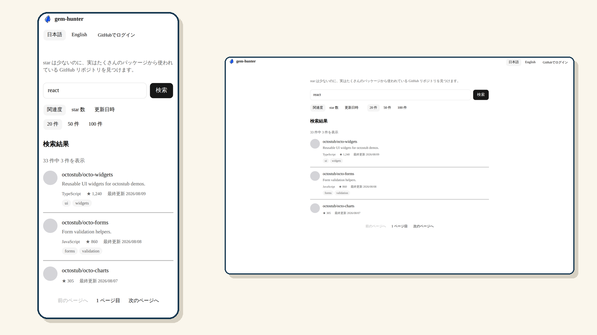

**ひとことで言うと**: 検索結果はキーワード・並び順・ページ番号を含めて URL 1 本に載るので、共有しても戻っても同じ画面が再現できます。

このスライドで見せている画面は、SP-1〜SP-7 という一連のスプリントで作られた検索の骨格です。検索条件がすべて URL に載る設計は「後から変えると全体に波及する境界」の一つとして、SP-2 の段階であらかじめ固定されました。詳細ページを（モーダルではなく）独立した URL のページにしたのも同じ理由で、リロード・URL 共有・ブラウザの戻る操作がそのまま機能する状態を作っています。

初見の人がつまずきやすいのは「並び替えは関連度・star 数・更新日時から選べるが、Gem Index という独自指標では並ばない」という点です。この点は次のスライド以降で扱います。もう一つの特徴は、詳細ページの README までサーバー側（SSR）で描画してから返す設計です。クライアントの JavaScript が実行されるのを待たずに本文が表示されるため、初回表示でコンテンツが遅れて出てくることがありません。ログインの有無も機能には影響せず、変わるのは GitHub API のレート枠（未ログインはアプリ共有枠、ログインは各自の枠）だけです。

> **用語**: **SSR（サーバーサイドレンダリング）** … サーバー側で HTML を完成させてからブラウザへ返す方式。クライアントの JavaScript の実行を待たずに本文が表示される。

**一次資料**: [user-story-map.md](../../../docs/02_requirements/user-story-map.md) SP-1〜SP-11 / [ADR 0012](../../../docs/adr/0012-optional-github-oauth.md)

---

## スライド 3: 検索しなくても、その日の Gem が並ぶ

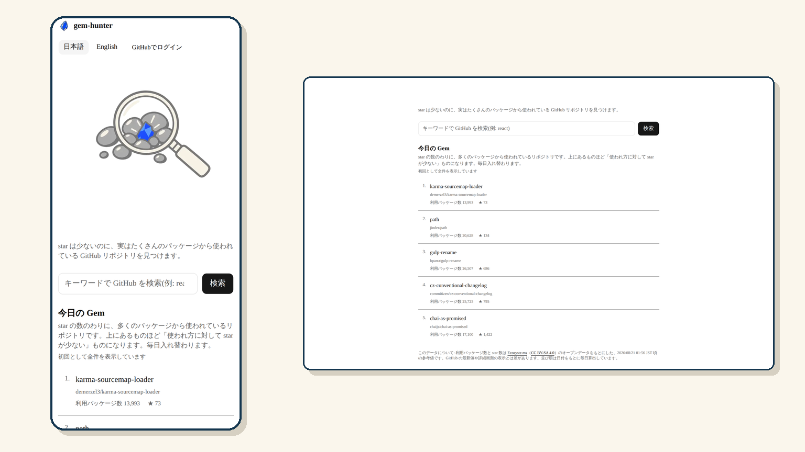

**ひとことで言うと**: トップページの「今日の Gem」は、1 文字も検索しなくても毎日 5 件の候補が決定論的に並ぶ、独立した発見機能です。

この機能は SP-14 で追加された、キーワード入力を前提にしない発見面です。並び順は UTC の日付文字列だけをシードにした決定論的な計算で決まるため、サーバーは利用者ごとの状態を一切持たず、同じ日なら誰が見ても同じ 5 件が表示されます。`?date=YYYYMMDD` をクエリに付けると当日以外の日付をシードにでき、翌日を待たずに顔ぶれの入れ替わりを確認できます（不正な日付は当日の値にフォールバックするため、本番の見え方は変わりません）。

並びに使っているのが Gem Index という指標で、「被依存数の順位」から「star の順位」を引いた値です。この指標を検索結果の並べ替えにも使う計画は実際にあり、一度実装されましたが、実測の結果うまく機能せず撤去されています。**現在 Gem Index が使われているのはこのダイジェストだけで、キーワード検索の並び順には効きません**。表示するデータは Ecosyste.ms（CC BY-SA 4.0）が出典で、画面には出典・ライセンス・生成時刻も明記しています。

> **用語**: **Gem Index** … エコシステム内での「被依存数のパーセンタイル順位」から「star のパーセンタイル順位」を引いた指標。値が大きいほど、実際に使われている割に注目されていないことを示す。
> **用語**: **Ecosyste.ms** … OSS パッケージのメタデータ（依存関係など）を提供するオープンなデータセット。CC BY-SA 4.0 で公開されている。

**一次資料**: [ADR 0014](../../../docs/adr/0014-zero-query-daily-digest.md) §2.1 / §2.2 / [open-questions.md](../../../docs/02_requirements/open-questions.md) D-33

---

## スライド 4: star の多さは、使われている証拠ではない

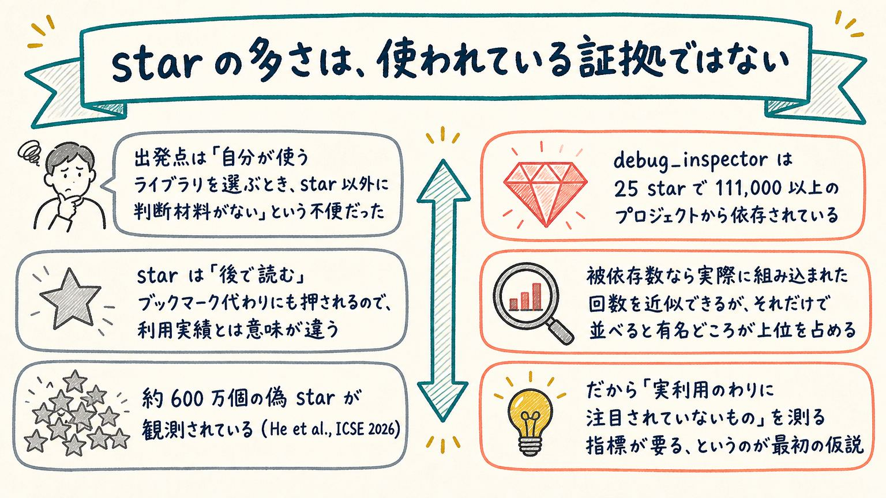

**ひとことで言うと**: 実際に使われているかどうかと star の数は別物であり、この不一致こそが gem-hunter を作った動機です。

出発点は「自分が使うライブラリを選ぶとき、star 以外に判断材料がない」という開発者自身の不便さでした。star は便利なライブラリを見つけたときだけでなく、後で読むためのブックマーク代わりにも押されるため、実際にプロジェクトへ組み込まれているかどうかとは別の意味を持ちます。この不一致を裏づける一次資料として、約 600 万個の偽 star が観測されている（He et al., ICSE 2026）という報告と、`debug_inspector` というリポジトリが 25 star でありながら 111,000 以上のプロジェクトから依存されているという実例が引用されています。

では被依存数（実際に依存されている回数）を基準に並べれば解決するかというと、そう単純ではありません。多くのプロジェクトに使われているライブラリほど star も集めやすい相関があるため、被依存数だけで並べ替えても結局は有名どころが上位を占めてしまいます。だから「実利用のわりに注目されていないもの」を単独で測る指標が必要だ、というのが最初の仮説でした。この仮説がどう指標（Gem Index）に落とし込まれ、検索結果への適用がどう撤去されたかは、後半のスライドで扱います。

**一次資料**: [initial-concept.md](../../../docs/00_concept/initial-concept.md) / [lean-canvas.md](../../../docs/00_concept/lean-canvas.md) P-1・P-2 / [ADR 0009](../../../docs/adr/0009-hidden-gem-score-definition.md) §2.1

---

## スライド 5: 構想を、辿れるドキュメントに分解した

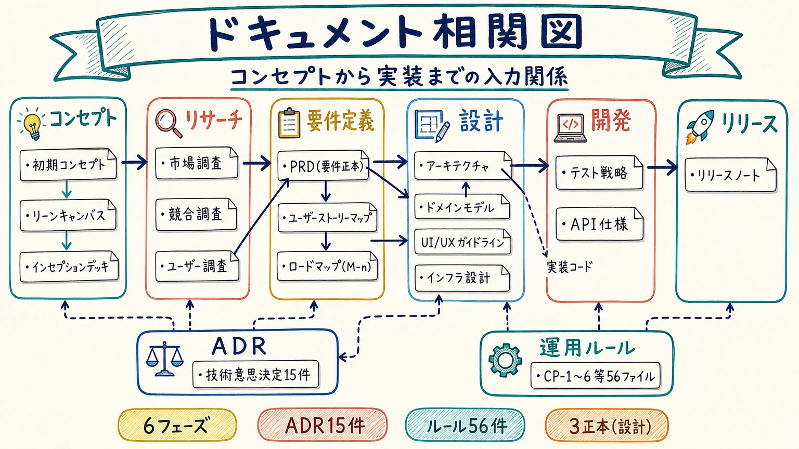

**ひとことで言うと**: 著者自身の初期構想（IndieGems）を外部から与えられた要件でスコープを絞り直し、コンセプト → 要件 → 設計 → 開発の順にドキュメントとして積み上げました。

プロジェクトは、著者自身が構想した「IndieGems」という初期コンセプトから始まりましたが、その後に外部から提供された最低要件定義（与件）によってスコープを絞り直しています。与件は「割ってはいけない下限」として固定され、初期コンセプトが描いていた Gem Score や目的別タグといった機能は、与件を満たした後に追加する上乗せ要件として別枠に整理し直されました。

ドキュメントはコンセプト → 要件 → 設計 → 開発の順に積み上げられ、「何を作るか」を決める要件の正本は `prd.md` 1 本に集約されています。一方で「なぜその技術・設計を選んだか」という判断理由は ADR（Architecture Decision Record）に別立てで残されており、まだ決めきれない論点は `open-questions.md` に `D-n` という番号で保留されます。この分離のおかげで、実装が進んでからも「これはどこかで決めたはずだ」という判断を後から辿れる状態になっています。各ドキュメントは 16:9 のインフォグラフィック 1 枚に要約されており、このスライド自体もその要約画像の 1 つを使っています。

> **用語**: **PRD** … Product Requirements Document（要件定義書）の略。gem-hunter では「何を作るか」の正本として `prd.md` に置かれている。
> **用語**: **ADR** … Architecture Decision Record の略。「なぜその技術・設計を選んだか」という決定理由を記録するドキュメント。

**一次資料**: [docs/README.md](../../../docs/README.md) / [inception-deck.md](../../../docs/00_concept/inception-deck.md) Q1 / [minimum-requirements.md](../../../docs/02_requirements/minimum-requirements.md) / [infographics/README.md](../../../docs/infographics/README.md)
## スライド 6: 依存は内側へ。中心のドメインは何も知らない

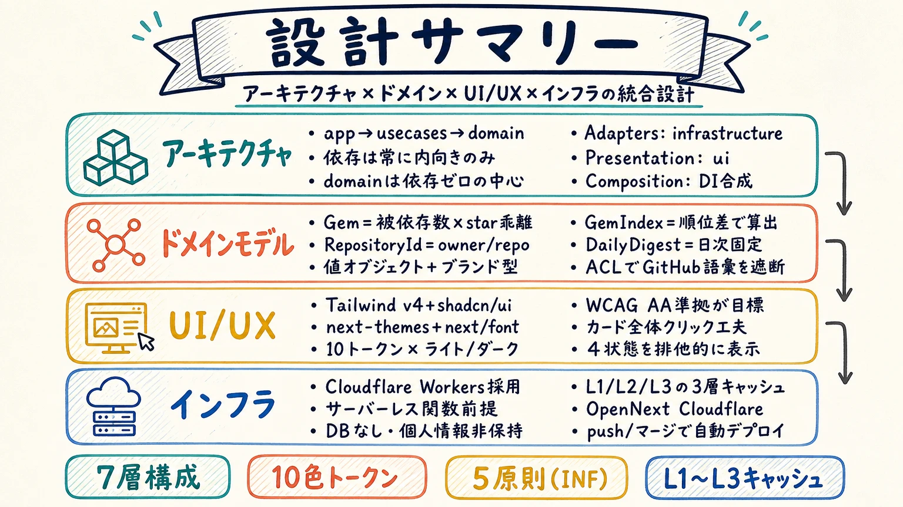

**ひとことで言うと**: gem-hunter は 7 層に分け、依存の向きを「外側から内側」の一方向だけに制限しています。

gem-hunter のコードは `domain` / `usecases` / `infrastructure` / `ui` / `composition` / `app`（Next.js）/ `shared` の 7 層に分かれています。ここで守られている規則はただ 1 つ、「内側は外側を知らない」ことです。最も内側にある `src/domain/` は、`next` も `react` も `zod` も import しません。GitHub のデータを取りに行くのも、画面に描画するのも、すべて `domain` より外側の層の仕事であり、`domain` 自身はそれらの存在を知らないまま書かれています。

この一方向性を保つ仕組みが「ポート」です。ユースケース層は、GitHub API を呼ぶコードを直接 import するのではなく、ドメイン層が定義したポート（`interface`）を引数として受け取ります。実装（たとえば GitHub API を叩くコード)は、ポートに適合する形で外から差し込まれます。これを依存性逆転と呼びます。この仕組みのおかげで、`app/` や `src/ui/` から `src/infrastructure/` へ直接 import することは禁止されており、実装をポートへ束ねてよいのは `src/composition/`（合成の場所）だけに限られています。GitHub API とその認証情報は `src/infrastructure/github/` の中だけ、Cloudflare など事業者固有の API は `src/infrastructure/platform/` の中だけに置く、という置き場所のルールも同じ発想から来ています。

ポートの数もあらかじめ絞られています。検索・キャッシュ・レート制限・時刻・認証の 5 つだけが定義されており、この表にないポートは実装しない、という歯止めが敷かれています。これは後述するスライド 7 の「層を足す条件」と対になっており、「クリーンアーキテクチャだから層を増やす」のではなく、増やす理由を先に決めてから増やすという順序を守るための土台になっています。

> **用語**: **クリーンアーキテクチャ** … ソフトウェアを同心円状の層に分け、依存の向きを常に外側から内側へ一方向に限定する設計の考え方です。内側の層（ここではドメイン）は外側の層の実装を一切知らないため、外側（フレームワークや外部 API）を差し替えてもドメインのロジックは影響を受けません。

**一次資料**: [アプリケーションアーキテクチャ §1.1-1.3・§2](../../../docs/03_design/architecture/application-architecture.md) / [architecture-rules.md §2](../../../docs/rules/architecture-rules.md)

## スライド 7: 層を足す条件を、3 つに決めてある

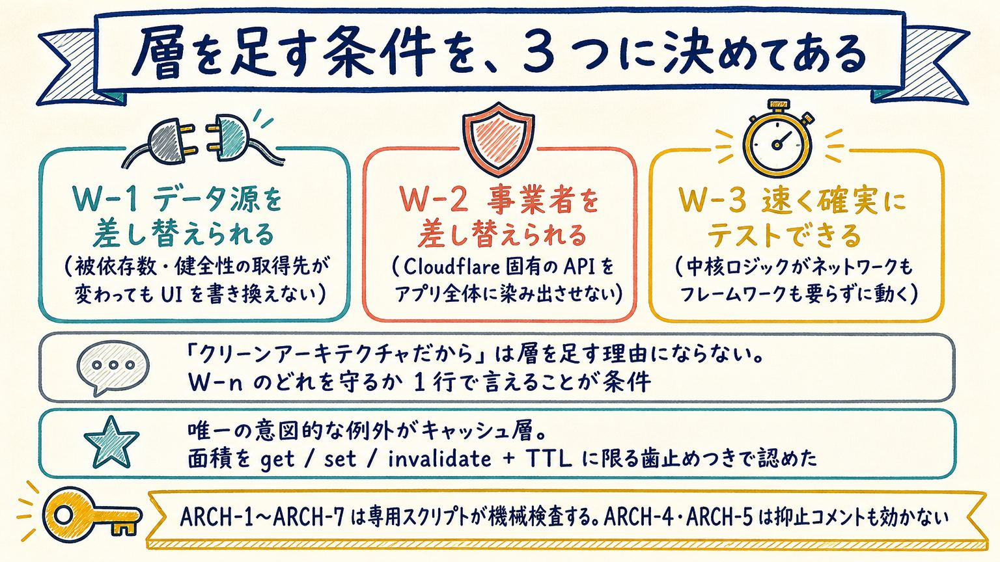

**ひとことで言うと**: 層や抽象を増やしてよいのは、`W-1`〜`W-3` のどれかを守るためだと 1 行で言えるときだけです。

クリーンアーキテクチャは層を増やせば増やすほど「柔軟」に見えてしまいますが、gem-hunter はその誘惑に歯止めをかけています。層を分ける理由は `W-1`（データ源を差し替えられる）・`W-2`（事業者を差し替えられる）・`W-3`（速く確実にテストできる）の 3 つに限定されており、「クリーンアーキテクチャだから」という理由だけでは層を足せません。新しい層やインターフェースを追加したくなったら、まず `W-1`〜`W-3` のどれを守るためかを 1 行で言えることが条件になります。言えないなら追加しない、という単純な判定基準です。

この基準がどう働くかを最もよく示すのが、`CachePort`（キャッシュ層)の扱いです。1 か所でしか使わない抽象を先回りで追加しないのが原則である一方、gem-hunter はサーバーレス関数の上で動くためインスタンスごとにメモリが使い捨てられ、プロセス内キャッシュは前提にできません。ここで `W-3`（速く確実にテストできる)と `W-1`（データ源を差し替えられる)の両方に効くという理由から、`CachePort` だけは意図的な例外として認められています。ただし例外を無制限に広げないよう、ポートの面積を `get` / `set` / `invalidate` と TTL だけに絞り、汎用的なキャッシュライブラリを自作しないという歯止めが同時に課されています。

この規律は文書に書いて終わりではなく、`ARCH-1` から `ARCH-7` として専用スクリプト（`tools/check_architecture_boundaries.py`)が機械的に検査します。とくに事業者固有バインディングの置き場所（`ARCH-4`)と GitHub API・認証情報の置き場所（`ARCH-5`)は、コード中に抑止コメントを書いても検査を通り抜けられません。「うっかり良い判断」に頼らず、決めた境界を機械が守る形にしているのがこのプロジェクトの特徴です。

> **用語**: **YAGNI** … "You Aren't Gonna Need It" の略で、「今必要でない機能や抽象は作らない」という設計の原則です。gem-hunter では層や抽象を増やす前に `W-1`〜`W-3` を問うことで、この原則を具体的な判定手順に落とし込んでいます。

**一次資料**: [application-architecture.md §1.1](../../../docs/03_design/architecture/application-architecture.md) / [architecture-rules.md §2 の ARCH 表](../../../docs/rules/architecture-rules.md) / [ADR 0005 §3.1](../../../docs/adr/0005-cache-port-yagni-exception-and-ttl.md)

## スライド 8: Next.js 16 を Workers の上で動かす

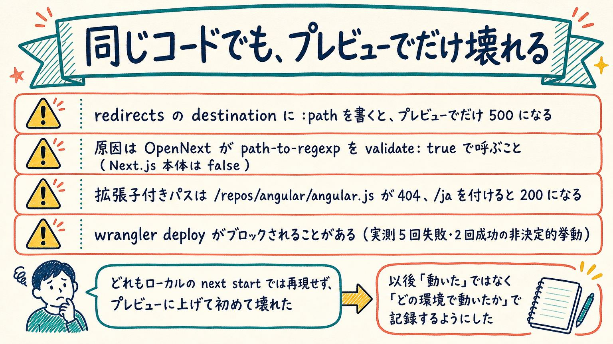

**ひとことで言うと**: gem-hunter は Next.js 16（App Router）を Cloudflare Workers 上で動かす構成を採用しています。

フレームワークには Next.js 16（App Router・React Server Components）を使い、クライアント側に送る JavaScript を最小限に保つ方針をとっています。既定では Server Component を使い、`"use client"` はフォーム入力やテーマ切替のようにインタラクションが本当に必要な箇所だけに限定しています。UI は Tailwind CSS v4 と shadcn/ui（基盤には Radix UI を明示指定)を採用しており、アクセシビリティを一次情報で保証できることを選定理由の 1 つとしています。

実行環境には Cloudflare Workers を選び、Next.js を Workers の上で動かすために OpenNext（`@opennextjs/cloudflare`)というアダプタを挟んでいます。この選定は、データベースや R2・D1 のような永続ストアを使わない設計方針（DB レス原則)と表裏一体です。R2 のような永続ストアは有効化に支払い方法の登録が必要で、無料枠を超えたら停止するという Cloudflare Free プランの構造的な上限を自ら手放すことになるため、キャッシュには HTTP の `Cache-Control` と Workers Caching だけを使う、という判断に落ち着いています。

テストは Vitest 4 + Testing Library + MSW 2 による単体・結合テストと、Playwright と axe による E2E テストの組み合わせです。ここまでの技術選定に共通しているのは、「事業者固有の API をアプリコードへ持ち込まない」という制約（`NFR-21`)です。デプロイ先そのものは Cloudflare に確定していますが、事業者固有のバインディングへのアクセスは `src/infrastructure/platform/` の中だけに限定するという設計原則は今も維持されており、スライド 6・7 で見た層の分離がここでも効いています。

**一次資料**: [README.md 技術スタック表](../../../README.md) / [ADR 0002](../../../docs/adr/0002-cloudflare-workers-infrastructure.md) / [ADR 0006](../../../docs/adr/0006-nextjs16-app-router.md)

## スライド 9: 同じコードでも、プレビューでだけ壊れる

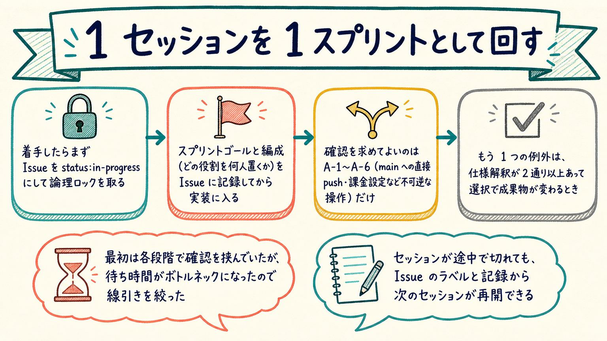

**ひとことで言うと**: gem-hunter は、ローカルでは再現せずプレビュー環境（Cloudflare)に上げて初めて表面化する不具合をいくつも踏んでいます。

1 つ目は `redirects()` の `destination` に `:path` のようなパラメータをそのまま書くと、Cloudflare プレビューでだけ 500 エラーになるという罠です。原因は、OpenNext のルーティング層が `destination` の値を `path-to-regexp` の `compile()` に「検証あり（`validate: true`)」で通すのに対し、Next.js 本体は「検証なし（`validate: false`)」で呼んでいるという実装差にありました。ローカルの `next start` では検証がかからないため問題が起きず、プレビューに上げて初めて発覚します。対策は `destination` 側にもパターンを明示し、パラメータがスラッシュを含む値でも通るようにすることでした。

2 つ目は拡張子付きパスの扱いです。`/repos/angular/angular.js` のようにロケール接頭辞のない URL は 404 になる一方、`/ja/repos/angular/angular.js` のようにロケールを付けると 200 で返る、という挙動の割れが実測で確認されています。3 つ目は本番デプロイコマンド（`wrangler deploy`)そのものが、Claude Code の auto mode classifier というガードレールにブロックされることがある、という罠です。これは実測でブロック 5 回・成功 2 回という非決定的な挙動で、何が分かれ目かはまだ特定できていません。

これら 3 つに共通するのは、どれもローカルの `next start` では再現しないという点です。この経験から、以後は「動いた」ではなく「どの環境で動いたか」を明記して記録する、という運用に変わりました。動作確認をローカルだけで済ませず、実際にデプロイする環境（プレビュー)で確かめることの重要性を、実際に手を動かして学んだ事例です。

**一次資料**: [cloud-environment.md L-129 / L-130](../../../docs/rules/lessons/cloud-environment.md) / [ADR 0002 決定 #6 の追記（`D-31`）](../../../docs/adr/0002-cloudflare-workers-infrastructure.md)

## スライド 10: 1 セッションを 1 スプリントとして回す

**ひとことで言うと**: gem-hunter は、Claude によるセッション 1 回を開発のスプリント 1 回として扱う運用ルールを定めています。

このプロジェクトでは、着手時にまず GitHub Issue を `status:in-progress` というラベルに変更します。これは複数のセッションが並行して同じ対象に手を出してしまう競合を避けるための「論理ロック」で、作業の最初のアクションとして行うことがルールで決められています。続けてスプリントのゴールと編成（どの役割を何人置くか)を Issue に記録してから実装に入る、という順序も定めてあります。

このプロジェクトのルールでは、ユーザーに確認を求めてよい場面を明確に絞り込んでいます。1 つは `main` ブランチへの直接 push や課金設定の変更のように、後から取り消せない操作（A-1〜A-6 と呼ばれる境界)です。もう 1 つは、仕様の解釈が 2 通り以上あり、どちらを選ぶかで成果物が変わってしまうときです。それ以外の場面、たとえば実装手段やライブラリの選び方、命名などは、最も単純で合理的な解釈を採用し、その仮定を記録に残したうえで自律的に進める、というルールになっています。当初は各段階で確認を挟んでいたものの、待ち時間がボトルネックになったため、この線引きに絞ったという経緯がルール文書に記されています。

セッションが途中で切れてしまっても、Issue に付いたラベルや記録された内容を手がかりに、次のセッションが続きから再開できるように設計されています。ここで書いているのはあくまで「そう運用すると決めているルール」であり、実際にどれだけ効率が上がったかという効果そのものは、このドキュメントでは断定していません。

> **用語**: **スプリント** … 一定のまとまった期間（ここでは Claude の 1 セッション)を単位として、目標設定から実装・レビューまでを完結させる開発の進め方です。

**一次資料**: [session-sprint-rules.md §1-2](../../../docs/rules/session-sprint-rules.md) / [user-confirmation-minimization.md §1](../../../docs/rules/user-confirmation-minimization.md) / [sprint-development-rules.md SD-3](../../../docs/rules/sprint-development-rules.md)
## スライド 11: テストを先に書き、緑でなければ進めない

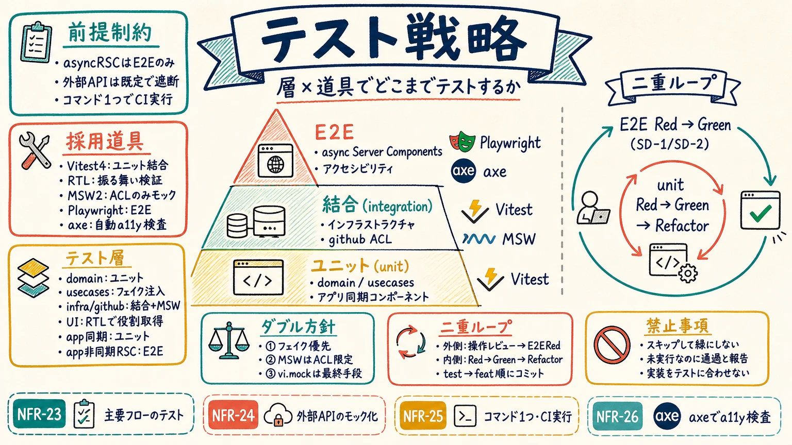

**ひとことで言うと**: 実装コードを書く前に失敗するテストを用意し、それが緑にならない限り次の作業に進まないという規律を、テスト基盤が整う SP-4 以降のスプリントに課しています。

gem-hunter のテストは Red → Green → Refactor の順を崩さない二重ループで回します。外側のループでは、ユーザーストーリーマップの操作レビュー手順をそのまま Playwright の E2E テスト名として先に書きます（この時点では失敗して構いません）。内側のループでは値オブジェクト → ユースケース → ACL → UI の順に、失敗するユニットテストを先に書いてから実装します。コミットも `test:` → `feat:` の順に分けて残す決まりで、この順序が守られているかは `self_review_check.py` が機械的に検知します。

単体・結合テストは Vitest 4 と React Testing Library が担い、外部 HTTP 境界のモックには MSW 2 を使います。ただし MSW を使ってよいのは GitHub API への窓口である ACL 層だけで、それより内側のユースケース層は手書きのフェイク実装を注入する決まりです。`async` な Server Component は Next.js 公式もユニットテストでの描画を推奨していないため、画面遷移や URL 状態を伴う検証は Playwright と axe による E2E に寄せています。

なお、テスト基盤が整う SP-4 より前の SP-1〜SP-3 は「テストを書ける対象から先に書く」に緩和されており、この期間だけを見て規律が守られていないと判断しないよう注意が必要です。また「テストを後回しにした回は、後から直すコストの方が高くついた」という一文は、このプロジェクトの実績についての記述であり、TDD 一般の効果を保証するものではありません。

> **用語**: **TDD**（Test-Driven Development）… 実装コードを書く前に、まず失敗するテストを書き、それを通す最小限の実装を書いてから整理する開発手法。**MSW**（Mock Service Worker）… ネットワーク層で HTTP リクエストを横取りし、モック応答を返すテスト用ライブラリ。

**一次資料**: [testing-strategy.md](../../../docs/04_development/testing-strategy.md) / [sprint-development-rules.md（SD-2）](../../../docs/rules/sprint-development-rules.md)

## スライド 12: 機械検証を通さないと PR を出せない

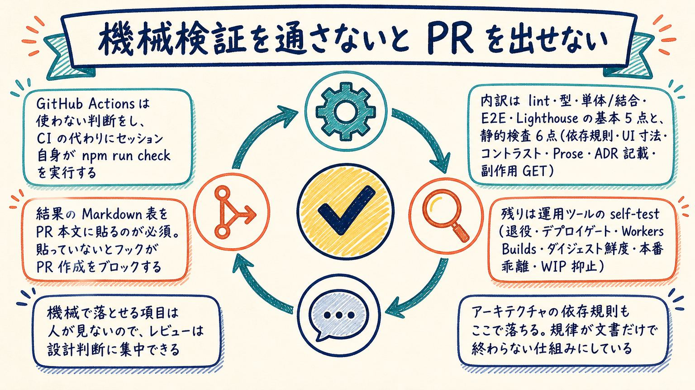

**ひとことで言うと**: GitHub Actions が使えないため、CI の代わりにセッション自身が `npm run check` を実行し、その結果を PR 本文に貼らない限り PR 作成そのものがフックでブロックされます。

`tools/run_checks.sh` は実測 20 項目のチェックを 1 コマンドで実行します。内訳は Lint（eslint）・型チェック（tsc）・単体結合テスト（vitest）・E2E（Playwright）・Lighthouse（Accessibility ゲート）の基本 5 点、依存規則・UI 寸法検査・配色コントラスト検査・Prose トークン検査（本体と self-test の 2 本）・ADR / README 記載検査・副作用 GET のプリフェッチ検査という静的検査 7 点、CJK Markdown 整形とセルフレビュー機械チェックの 2 点、退役スクリプト・デプロイゲート・Workers Builds デプロイ入口・ダイジェスト鮮度・本番乖離検知・WIP 抑止ガードという運用ツールの self-test 6 点、で合計 20 項目です。

この結果を貼ることは任意ではありません。`.claude/hooks/pre-pr-create-check.sh` という PreToolUse フックが、PR 本文の文字列に「run_checks」が含まれていない場合、GitHub Actions が無い代わりの唯一の機械的証跡が無いと判断して PR 作成そのものをブロックします。同じフックは `self_review_check.py` も実行し、Error を検出すればここでもブロックします（チェッカー自体が異常終了した場合はブロックせず警告に留め、無人運用を止めない設計です）。

機械で判定できる項目を人の目に回さないことで、後段のセルフレビューは設計判断やロジックの妥当性に集中できます。依存規則の検査もこの段階で落ちるため、クリーンアーキテクチャの依存の向きは文書上の約束にとどまらず、PR を出す前に必ず実行されるスクリプトとして担保されています。

> **用語**: **PreToolUse フック**… Claude Code がツール（ここでは PR 作成コマンド）を実行する直前に割り込み、条件を満たさなければ実行そのものを止める仕組み。

**一次資料**: [tools/run_checks.sh](../../../tools/run_checks.sh) / [pre-pr-create-check.sh](../../../.claude/hooks/pre-pr-create-check.sh) / [pr-review-flow-summary.md](../../../docs/rules/pr-review-flow-summary.md)

## スライド 13: レビューは、他人の PR として読み直す

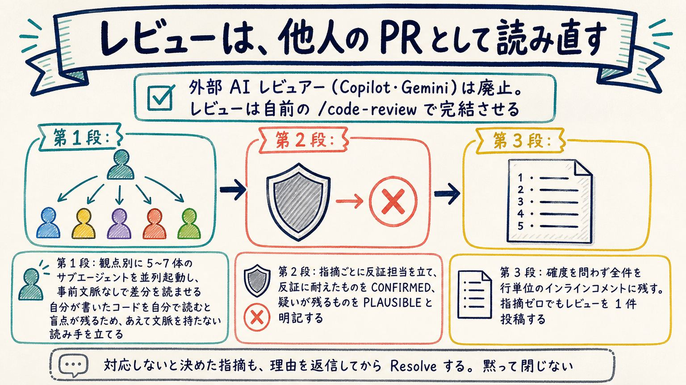

**ひとことで言うと**: 外部 AI レビュアーへの依頼はやめ、自分の書いたコードを事前文脈のないサブエージェントに「他人の PR」として読ませ、指摘には反証担当を立ててから記録する 3 段構成のセルフレビューに一本化しています。

「AI が自分の書いたコードを自分でレビューして意味があるのか」という疑問への回答が、この 3 段構成の設計そのものです。第 1 段では正確性・セキュリティ・簡素化と再利用・テストと検証・ドキュメント整合という 5 つの観点（差分が `app/` や `src/` を含む場合はアーキテクチャ・ドメイン整合、`app/` や `src/ui/` を含む場合は UI・アクセシビリティも追加）ごとに、独立したサブエージェントを並列で起動します。各エージェントには実装の経緯や意図をあえて渡さず、差分だけを「第三者の PR」として読ませます。同じセッションが同じ文脈のまま読み返すと見落としがちな盲点を、文脈を持たない読み手に肩代わりさせる狙いです。

第 2 段は敵対的検証です。第 1 段が出した指摘をそのまま採用せず、指摘ごとに反証担当のサブエージェントを立て「既存のガードで防がれていないか、実際に到達可能か」を検証させます。反証に耐えた指摘だけを CONFIRMED、疑いが残るものを PLAUSIBLE として区別します。過剰な指摘（実際には問題にならないものまで指摘してしまうこと）を減らすための工程です。

第 3 段では確度を問わず全件を PR の行単位インラインコメントとして投稿します。指摘がゼロ件でも、レビューを実施した事実自体を 1 件のレビューとして残します。対応しないと決めた指摘も、理由を返信してから Resolve するため、黙って閉じることはありません。

> **用語**: **CONFIRMED / PLAUSIBLE**… 反証を経てなお欠陥が残ると判断された指摘を CONFIRMED、反証しきれないが疑いが残る指摘を PLAUSIBLE と呼ぶ確度のラベル。

**一次資料**: [.claude/skills/code-review/SKILL.md](../../../.claude/skills/code-review/SKILL.md) / [ai-reviewer-strategy.md](../../../docs/rules/ai-reviewer-strategy.md) / [pr-review-flow.md](../../../docs/rules/pr-review-flow.md)

## スライド 14: 実装からマージまで、確認なしで走り切る

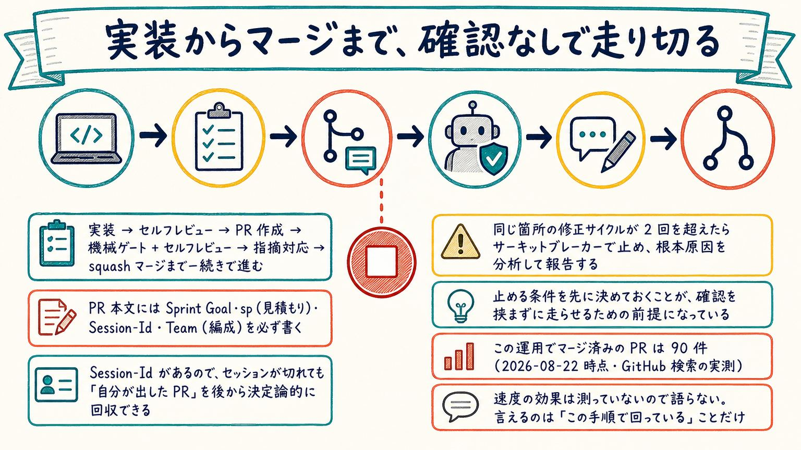

**ひとことで言うと**: 実装完了から PR 作成・セルフレビュー・指摘対応・squash マージまでを、ユーザー確認を挟まず一続きで自律実行する運用にしており、2026-08-22 時点でこの手順によりマージ済みの PR は 90 件です。

実装が完了したら、PR 作成の可否をユーザーに尋ねる代わりにそのまま PR を作成し、機械ゲート（前スライドの `npm run check`）とセルフレビュー（スライド 13 の 3 段構成）を通し、指摘対応を終えたら squash マージまで進みます。「PR を作ってよいですか」と確認を挟むこと自体を避けるルールがあり、確認してよいのは main への直接 push など不可逆な操作（既約境界外）か、仕様解釈が 2 通り以上あって選択によって成果物が変わる場合だけに絞られています。

PR 本文には Sprint Goal（スプリントの目標）・sp（見積もりのストーリーポイント）・Session-Id・Team（編成）を必ず書く決まりになっています。Session-Id を記録しておくことで、セッションが途中で切れても、後から再開したセッションが「自分が出した PR」を PR 本文の文字列照合だけで確実に見つけ出し、責任を引き継げます。

歯止めもあります。同じ箇所の修正サイクルが 2 回を超えたら、それ以上は自律で続けずサーキットブレーカーで止まり、調査結果とともにユーザーへ報告する決まりです。止まる条件を先に決めておくことが、それ以外の場面で確認を挟まずに走らせるための前提になっています。なお、この運用によって開発が速くなったかどうかは計測しておらず、言えるのは「この手順で回っている」ことと、マージ済み PR の件数（90 件・2026-08-22 時点の GitHub 検索実測）だけです。

> **用語**: **サーキットブレーカー**… 同じ問題への修正の試行が一定回数（ここでは 2 回）を超えたら、それ以上自動で繰り返さずに強制的に立ち止まり、人の判断を仰ぐ仕組み。

**一次資料**: [pr-review-flow-summary.md](../../../docs/rules/pr-review-flow-summary.md) / [pr-review-flow.md（サーキットブレーカー）](../../../docs/rules/pr-review-flow.md) / [session-concurrency-rules.md](../../../docs/rules/session-concurrency-rules.md)

## スライド 15: Gem Index ＝ 被依存数と star の残差

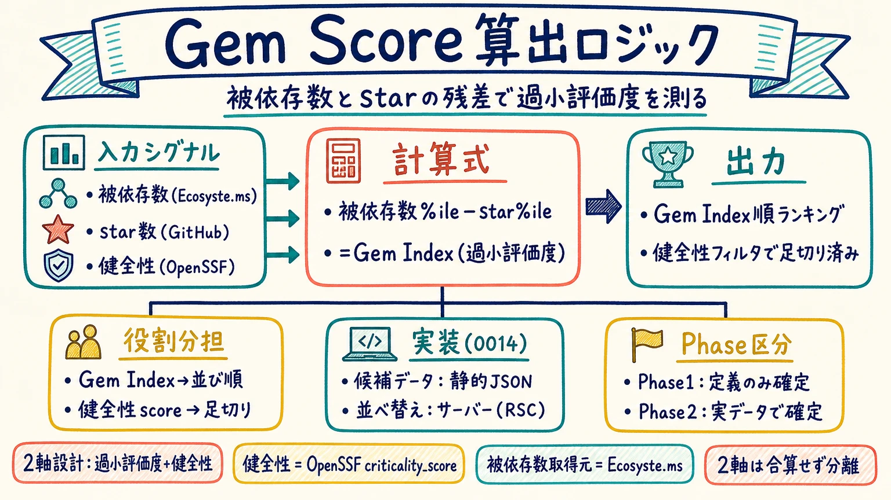

**ひとことで言うと**: Gem Index は、そのエコシステム内で「どれだけ使われているか（被依存数）の順位」から「どれだけ注目されているか（star 数）の順位」を引き算した値で、注目度の割に使われているリポジトリほど大きくなります。

具体的には、被依存数のパーセンタイル順位から star のパーセンタイル順位を引きます。パーセンタイル順位（全体の中で自分がどの位置にいるかを相対値で表したもの）で比べているため、パッケージの絶対数が言語やエコシステムによって大きく違っていても、同じ尺度の上で比較できます。被依存数は Ecosyste.ms の npm レジストリ API から、star 数は GitHub API から取得しています。

この「引き算」という形が、star の水増し（偽 star）に構造的に強い理由です。star だけを見て順位付けする方式では、star 数を人為的に増やせばそのまま順位が上がってしまいますが、Gem Index は star を順位から差し引く側として使うため、被依存数を変えずに star だけを水増しすると値はむしろ下がります。star を買っても順位は上がらない、という設計です。

健全性（メンテナンスがされているか）は OpenSSF の `criticality_score` という既存の指標をそのまま使い、自作しません。しかも健全性は Gem Index へ合算せず、足切り（フィルタ）にだけ使う役割分担になっています。合算すると、健全ではあるが有名なリポジトリが加重平均で上位に戻ってきてしまい、star 追随のランキングに逆戻りするためです。なお、Ecosyste.ms のデータは CC BY-SA 4.0 のライセンスで提供されており、画面には出典・ライセンス・生成時刻を明記しています。

> **用語**: **パーセンタイル順位**… 全体の中で自分がどのあたりの位置にいるかを、0（最上位）から 100（最下位）などの相対的な順位で表したもの。値そのものの大小ではなく「相対的な位置」を見る点が特徴。

**一次資料**: [ADR 0009](../../../docs/adr/0009-hidden-gem-score-definition.md) / [tools/generate_gem_digest.mjs](../../../tools/generate_gem_digest.mjs) / [src/ui/attribution-notice.tsx](../../../src/ui/attribution-notice.tsx)
## スライド 16: 作った差別化機能を、実測で撤去した

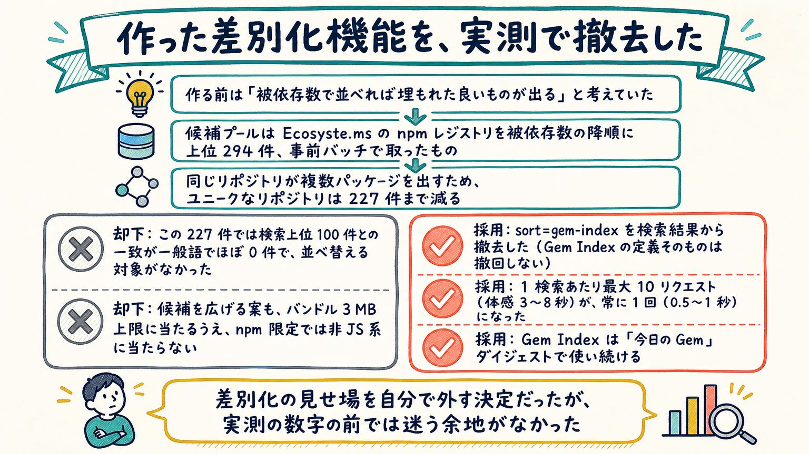

**ひとことで言うと**: 検索結果を Gem Index 順に並べる機能を作ったものの、実測したデータが「並べ替える対象がほぼない」ことを示したため、自分たちの手で撤去しました。

作る前の想定は素朴なものでした。「被依存数の多い順に並べれば、star ではまだ知られていないが実際に使われている OSS が浮かび上がるはずだ」という仮説です。これを検証するため、Ecosyste.ms の npm レジストリ API から被依存数の降順で上位 294 件をあらかじめバッチ取得し、検索結果の並び替えに使う候補プールとしました。ここでつまずいたのが母数でした。npm では 1 つの GitHub リポジトリが複数のパッケージを公開できるため、294 件の候補は重複を除くとユニークなリポジトリで 227 件まで減ります。

この 227 件を検索上位 100 件と突き合わせた結果、一致数は `react` で 8 件、`test` で 7 件、`cli` で 6 件、Python や Go のような非 JS 系の一般語ではほぼ 0 件でした。候補プールが npm レジストリ限定である以上、この構造的な限界はプールを広げても解決しません。実際、候補を 10 万件規模へ広げる案も検討しましたが、静的 JSON を JavaScript バンドルへ焼き込む現行実装では Cloudflare Workers Free のバンドル 3 MB 上限に単独で抵触するため、この案も却下しています。

最終的に採ったのは、検索結果への `sort=gem-index` の適用そのものを撤去する、という選択でした。ただし Gem Index という指標の定義自体は撤回していません。1 検索あたり最大 10 リクエスト(体感 3〜8 秒)かかっていた処理は、常に 1 リクエスト(体感 0.5〜1 秒)に短縮され、Gem Index は「今日の Gem」ダイジェストの中で使い続けています。自分たちが目玉として作った差別化機能を、自分たちの実測データを見て自分たちで外した、という決定です。

> **用語**: **候補プール** … 検索結果の並べ替えに使うため、あらかじめバッチ処理で取得しておいたリポジトリの集合です。gem-hunter では npm レジストリの被依存数上位 294 件(ユニークリポジトリで 227 件)がこれにあたります。

**一次資料**: [ADR 0009 §2.3 の D-33 追記](../../../docs/adr/0009-hidden-gem-score-definition.md) / [open-questions.md D-30・D-33](../../../docs/02_requirements/open-questions.md) / [ADR 0014 §2.6](../../../docs/adr/0014-zero-query-daily-digest.md) / [tools/generate_gem_digest.mjs](../../../tools/generate_gem_digest.mjs)

## スライド 17: 認証方式は 6 つの軸で選ぶ

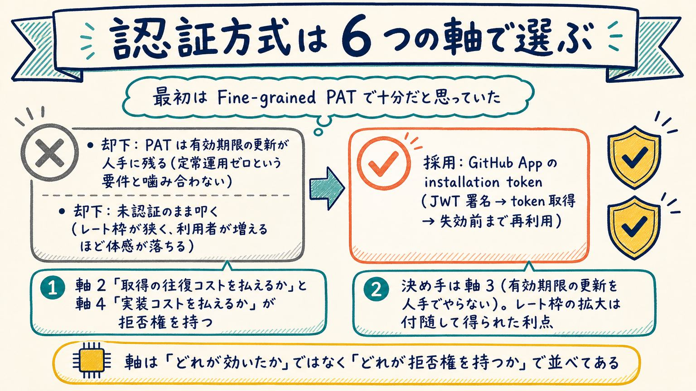

**ひとことで言うと**: サーバー側の GitHub 認証は、個々の軸の優劣ではなく「どの軸が拒否権を持つか」で GitHub App の installation token に決めました。

最初に検討したのは Fine-grained PAT(個人アクセストークン)でした。しかし単一の PAT には有効期限があり、更新を人手で行う必要があります。これは「定常運用の人手作業をゼロにする」という要件と噛み合いませんでした。無期限化すれば更新の手間は消えますが、今度は漏洩時の影響も無期限に残ります。未認証でのアクセスも検討しましたが、レート枠が Core 60 req/h・検索 10 req/分まで下がり、必要な枠を満たせません。

最終的に採用したのは GitHub App の installation token です。1 時間で失効するトークンをアプリ側が自動で取り直す方式で、人が保持するのは有効期限のない署名鍵だけになります。ADR 0003 は判断軸を 6 つに整理しており、そのうち軸 2(トークン取得の往復コストを払えるか)と軸 4(実装コストを払えるか)は「No なら他の軸の優位は意味を持たない」拒否権を持つ軸とされています。本プロジェクトで決め手になったのは軸 3(有効期限の更新を人手でやらない)で、Core API のレート枠が 5,000 req/h から実測 8,800 req/h に広がったのは決め手ではなく、副次的に得られた利点でした。

> **用語**: **GitHub App** … 個人アカウントに紐づく PAT とは異なり、アプリ単位でインストールされ、権限を絞った短命の installation token を自動発行して使う GitHub の認証の仕組みです。

**一次資料**: [ADR 0003 §3.2](../../../docs/adr/0003-github-app-authentication.md) / [ADR 0003 §6.1](../../../docs/adr/0003-github-app-authentication.md)

## スライド 18: Web アプリだが、DB を 1 つも持たない

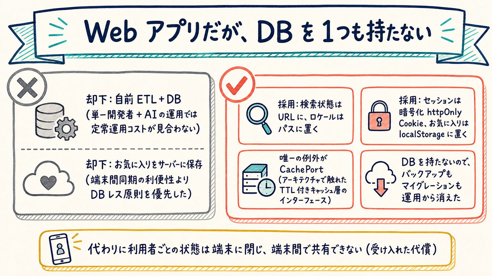

**ひとことで言うと**: サーバー側にデータベースを一切持たず、状態はすべてクライアント側(URL・Cookie・localStorage)に置いています。

検討の出発点は「自前の ETL パイプライン + DB を持つか、GitHub API を直接参照するか」でした。前者は被依存数などのデータを継続収集するバッチ基盤とスキーマ管理が必要になり、単一開発者 + AI による自律運用では定常運用コストが見合わないと判断して却下しています。お気に入りをサーバー側に保存して端末間で同期する案も検討しましたが、端末間同期の利便性より DB レス原則を優先し、こちらも却下しました。

採用したのは、状態の性質ごとに置き場所を振り分ける設計です。検索キーワード・ページ番号・並び順は URL の `searchParams` に、ロケールは URL のパスセグメントに、任意ログイン時のセッションは暗号化した httpOnly Cookie に、お気に入りは `localStorage` に置きます。唯一の例外がアーキテクチャの回で触れた CachePort(TTL 付きの再計算可能なキャッシュ)です。この構成によりスキーマ移行・バックアップ・容量監視という定常運用作業がそもそも発生しなくなりましたが、代わりに `localStorage` は端末間で同期されず、ブラウザのデータ削除で消え、容量上限も数 MB 程度という代償を受け入れています。

**一次資料**: [ADR 0007 §2](../../../docs/adr/0007-no-database-client-side-state.md) / [ADR 0007 §6](../../../docs/adr/0007-no-database-client-side-state.md) / [ADR 0005](../../../docs/adr/0005-cache-port-yagni-exception-and-ttl.md)

## スライド 19: 持ち帰れる 4 つの考え方

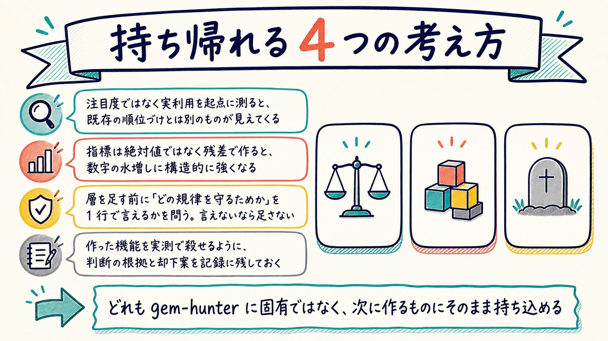

**ひとことで言うと**: gem-hunter で下した個々の判断ではなく、その判断の背後にある考え方だけを取り出すと、他のプロジェクトにもそのまま持ち込めます。

ここまでの 18 枚は 1 つのプロダクトの中の判断ですが、扱っている論点自体は個別の技術に閉じていません。星の数ではなく被依存数のような「実際に使われている量」を起点に測ると、既存の順位づけとは違う見え方が得られるという発見。指標を絶対値ではなく残差(パーセンタイル順位の差)として設計すると、水増しに構造的に強くなるという設計手法。層を追加する前に「どの規律を守るための層か」を 1 行で言えるかを問う、という歯止め。そして、実測データの前では自分が作った機能でも自分で撤去する、という意思決定の姿勢です。

これらは gem-hunter 固有の話ではなく、読者自身のプロジェクトに置き換えて使える考え方です。たとえば「人気」で並べている一覧があれば、それが本当に測りたいものの代理指標になっているかを一度疑ってみる。差別化機能を作るときは、候補プールの母数と被覆率を作る前に見積もっておく。層を追加する提案が出たら「どの規律のためか」を尋ねる。そして実測して自分の判断が誤りだったと分かったら、その機能を作った本人が撤去する、という順序を保つ。gem-hunter に固有の答えではなく、この一連の問い方そのものが持ち帰れるものです。

**一次資料**: [ADR 0009](../../../docs/adr/0009-hidden-gem-score-definition.md) / [application-architecture.md §1.1(W-1〜W-3)](../../../docs/03_design/architecture/application-architecture.md) / [open-questions.md D-33](../../../docs/02_requirements/open-questions.md) / [project-mission.md](../../../docs/project-mission.md)

## この資料そのものについて

このスライドは Claude Code のセッション上で、**外部リポジトリ [`kai-kou/qiita-bash-lt-2026`](https://github.com/kai-kou/qiita-bash-lt-2026) の
`slides` スキル（15 ステップのワークフロー）に沿って**作りました。構成づくり → セルフレビュー →
テキスト版 → ユーザーレビュー → 画像版 → ユーザーレビュー、という順で、各段のレビューを飛ばさずに進めています。

- 構成は 5 つのレンズ（構成・事実・受け手・ビジュアル・手順準拠）による議論型レビューで決めました（[議論記録](../../discussions/project-slides-20260822/whiteboard.md)）
- 構成マークダウンは 7 軸のセルフレビューにかけ、26 件の指摘のうち 24 件を反映しています（[Step 2 記録](./references/step2-self-review.md)）
- 画像は 19 枚を 1 枚ずつ目視で原稿と照合し、3 件の違反（大文字化・数字の追加・重複表示）を見つけて作り直しました（[Step 10 記録](./references/step10-self-review.md)）

作り方の詳細は [`references/README.md`](./references/README.md) にまとめてあります。

---

**この資料の作成日**: 2026-08-22（JST）
