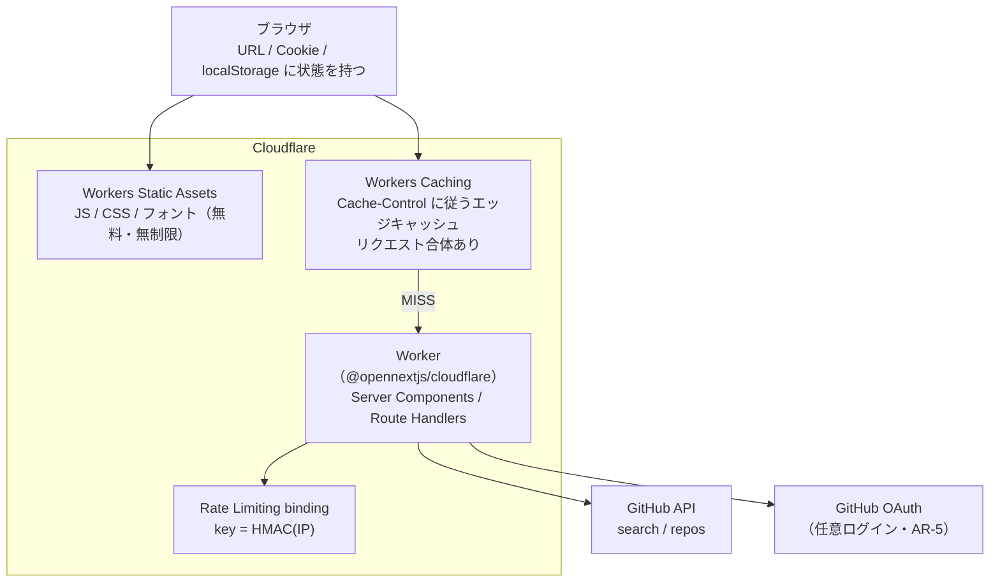

# gem-hunter Cloudflare インフラ設計

- **版**: 1.0
- **作成日**: 2026-08-18 JST
- **状態**: 確定（`D-16` / `D-17` / `D-18`）
- **位置づけ**: **事業者を Cloudflare に確定したときの実装先の正本**。契約（`INF-n`）の正本は [`infrastructure-design.md`](./infrastructure-design.md) であり、本書はその契約を **Cloudflare のどの機能で満たすか** を定める
- **根拠**: ユーザー明示決定（2026-08-18・「インフラについて Cloudflare ベースで進めたい」「アカウントは既存のものを使う」「MCP よりも CLI を利用する方針で」）/ [Cloudflare インフラ リサーチ](../../01_research/infra/20260818-cloudflare-research.md)（一次情報）/ [専門チーム議論](../../../content/discussions/cloudflare-infra-20260818/whiteboard.md)

---

## 0. このドキュメントについて

### 0.1. 正本としての責務範囲

**同じ事実を 2 箇所に書かない。** 本書が正本を持つのは次の 4 つだけである。

| 本書が正本を持つもの |
|---|
| `INF-n` 契約 → Cloudflare 機能の対応表（§2.2） |
| Cloudflare 固有の構成（ランタイム・キャッシュ・環境分離・CI/CD・プライバシー設定） |
| CLI 一次運用の規約（非対話実行・MCP アローリスト・`INF-20` の例外） |
| Free / Paid の判定式と、人間に残る作業（§5.3・§11） |

以下は他が正本を持ち、本書は ID で参照する。

| 情報 | 正本 |
|---|---|
| インフラに求める契約（`INF-1`〜`INF-22`）・移行手順 | [`infrastructure-design.md`](./infrastructure-design.md) |
| 要件 ID・受け入れ条件 | [`prd.md`](../../02_requirements/prd.md) |
| 環境変数の一覧 | [`prd.md`](../../02_requirements/prd.md) §10 |
| 各決定の理由・経緯 | [`open-questions.md`](../../02_requirements/open-questions.md) の `D-n` |
| Cloudflare の数値（無料枠・上限・料金） | [リサーチ](../../01_research/infra/20260818-cloudflare-research.md)（**変動するので実装時に再確認する**） |
| 選定判断の記録 | [ADR 0002](../../adr/0002-cloudflare-workers-infrastructure.md) |

### 0.2. 🔴 数値をここに書き写さない

Cloudflare の無料枠・上限・料金は変動する。本書は **判断に必要な最小限だけを引用し、根拠はリサーチの節番号で参照する**。数値を疑ったらリサーチではなく [Cloudflare 公式](https://developers.cloudflare.com/workers/platform/pricing/) を見る。

---

## 1. 決定サマリー

| ID | 決定 |
|---|---|
| **`D-16`** | デプロイ先を **プレビュー・本番とも Cloudflare Workers** に確定する（`D-7` / `D-11` をクローズ） |
| **`D-17`** | ランタイムは **`@opennextjs/cloudflare` アダプタ**。`next` は **16.2.11 以上** にピンする |
| **`D-18`** | MVP のキャッシュは **HTTP `Cache-Control` + Workers Caching のみ**。永続ストア（R2 / D1 / DO / KV）は採用しない |

あわせて運用方針を 2 つ確定する。

- **CLI（wrangler）が一次経路**。Cloudflare MCP は読み取り 4 ツールのみ（§7.4）
- **CI は GitHub Actions + `cloudflare/wrangler-action`**。Workers Builds は採用しない（§8）

---

## 2. 構成

### 2.1. 物理構成



🔴 **この図にも「データベース」が存在しない**（`D-5` 追補を維持）。Worker はリクエストを処理して捨てるだけで、次のリクエストへ持ち越す状態を持たない。エッジキャッシュは TTL 付きの揮発層であって永続ストアではない。

### 2.2. `INF-n` 契約 → Cloudflare 機能の対応

| 契約 | Cloudflare での満たし方 | 判定 |
|---|---|---|
| `INF-6` Node.js 互換ランタイム・Web Crypto | `compatibility_date` を 2026-08-04 以降にすると `nodejs_compat` が既定で有効。Web Crypto は互換フラグなしで利用可 | ✅ |
| `INF-7` リクエスト単位のサーバー実行 | Worker が Server Components / Route Handlers を実行する | ✅ |
| `INF-8` レスポンスストリーミング | 対応。ストリーミング中の Worker はアクティブ扱いで wall time 制限がない | ✅ |
| `INF-9` 環境変数のランタイム注入 | シークレット・変数が `process.env` に自動注入される（再ビルド不要） | ✅ |
| `INF-10` CDN 配信・`immutable` ヘッダ | Workers Static Assets。**リクエストは無料・無制限** | ✅ |
| `INF-11` 画像配信 | 🔵 **`next/image` の最適化を使わない**（§3.2）。GitHub のアバターは `avatars.githubusercontent.com?s=N` をそのまま使う | ⚠️ 方針は確定・**`NFR-6`（CLS）を満たすかは実測待ち**（§12 の 8） |
| `INF-12` 1 リクエスト 10 秒以内 | wall clock は無制限・課金対象外。GitHub API の待ち時間は CPU を消費しない | ✅ 余裕 |
| `INF-13` 永続ディスクを前提にしない | サーバーレスなので構造的に満たす | ✅ |
| `INF-14` 単一リージョンで成立 | エッジ実行だが、アプリはどこで動いても同じ（リージョン固有の前提を持たない） | ✅ |
| `INF-15`〜`INF-19` シークレット | `wrangler secret put`（GA）を環境ごとに使う。Secrets Store は open beta のため採用しない | ✅ |
| `INF-20` トリガーは git push / マージのみ | GitHub Actions。⚠️ `SP-1` のブートストラップ期間のみ例外（§7.5） | ⚠️ 条件付き |
| `INF-21` ロールバック | `wrangler rollback` / `wrangler versions deploy` | ✅ |
| `INF-22` 失敗の通知 | GitHub Actions の失敗通知 | ✅ |
| `INF-1` 個人情報を保持しない | §9 の設定で満たす。⚠️ アカウント運用ログ（Audit 18 か月等）はアプリの制御外 | ⚠️ 一部のみ |
| `INF-2` 定常コストをゼロに | Free plan を維持する限り超過は課金ではなく停止（§5） | ⚠️ 実測待ち |
| `INF-3` 与件の技術スタック | Next.js 16 App Router が動く。⚠️ Free の CPU / バンドル上限に収まるかは実測待ち（§5.3） | ⚠️ 実測待ち |
| `INF-4` 人手の定常運用ゼロ | ブートストラップ以外の定常作業はゼロ。⚠️ **ただし API トークンの期限切れを自動検知する仕組みが未実装**（§11.3） | ⚠️ 条件付き |
| `INF-5` 事業者を決め打たない | §10 の境界（`lib/infra/` 限定 + grep 2 本）で機械的に守る | ✅ |

---

## 3. ランタイム（`D-17`）

### 3.1. 採用するもの

| 項目 | 値 | 理由 |
|---|---|---|
| アダプタ | `@opennextjs/cloudflare` | Cloudflare 公式の唯一の推奨経路。`@cloudflare/next-on-pages` は npm 上で deprecated |
| `next` | **16.2.11 以上にピン** | アダプタ 1.20.2 の peer 依存が `>=16.2.11`。16.2.3 未満は CVE 未修正 |
| `wrangler` | `^4.86.0` 以上（実装時の最新） | アダプタの peer 依存 |
| Node（開発・CI） | **22 以上** | wrangler 4.x の `engines` 要件 |
| `compatibility_date` | 2026-08-04 以降 | この日付以降は `nodejs_compat` が既定で有効になる |

### 3.2. 🔴 使わないもの（地雷を踏まない設計）

| 使わない | 理由 | 代わりに |
|---|---|---|
| **Node.js Middleware** | アダプタが未対応で、検出するとビルドを早期エラーにする | 使わない |
| **`proxy.ts`**（Next 16 で `middleware.ts` から改名） | アダプタでの動作が一次情報で確認できない（未確認） | ルート `app/page.tsx`（Server Component）内で `headers()` から `accept-language` を読み `redirect('/ja')` する |
| `next/image` の最適化 | Cloudflare Images は月 5,000 変換の無料枠があるが、検索結果の大量アバターで unique 変換が膨らむ | GitHub のアバター URL のサイズパラメータ（`?s=N`）をそのまま使う（`INF-11`） |
| Secrets Store | open beta で Super Administrator ロールを要求する | `wrangler secret put`（GA） |
| Bot Fight Mode | 有効化すると WAF の Skip が効かず正当な API リクエストがチャレンジされうる | 有効化しない（Rate Limiting binding で足りる） |

> 🔵 **i18n（`E-4` / `SP-2`）への含意**: `/` → `/ja` のリダイレクトを **middleware で実装しない**。`next-intl` を採用する場合も、ルーティング機能ではなくメッセージカタログ API（`NextIntlClientProvider` / `getTranslations`）だけを使う分割にすれば、`proxy.ts` の未確認問題を構造的に踏まない。`SP-2` 着手前に `next-intl` の現行版仕様を context7 で一次確認する。

### 3.3. `wrangler.jsonc`（出発点）

```jsonc
{
  "$schema": "./node_modules/wrangler/config-schema.json",
  "name": "gem-hunter",
  "main": ".open-next/worker.js",
  "compatibility_date": "2026-08-04",
  "assets": { "directory": ".open-next/assets", "binding": "ASSETS" },
  "workers_dev": true,
  "preview_urls": true,
  "cache": { "enabled": true },
  "observability": { "enabled": true, "logs": { "invocation_logs": false } },
  "limits": { "cpu_ms": 50 },
  "ratelimits": [
    { "name": "RATE_LIMITER", "namespace_id": "1001", "simple": { "limit": 60, "period": 60 } }
  ]
}
```

- `preview_urls` は 2025-09-17 以降 opt-in。`workers_dev` を切るなら明示が必要
- `limits.cpu_ms` は Free では意味を持たないが、**Paid へ上げた瞬間に denial-of-wallet 対策として効く** ため最初から書いておく
- `ratelimits` は **`wrangler.jsonc` の宣言だけで有効になる**（事前のリソース作成コマンドは不要）。`namespace_id` はアカウント内で一意な任意の識別子、`period` は **10 秒か 60 秒のみ**。⚠️ wrangler 4.36.0 以上が必要
- ⚠️ `wrangler deploy` は設定ファイルを source of truth として扱う。**Dashboard で変えた設定は次回デプロイで巻き戻る**

---

## 4. キャッシュ（`D-18`）

### 4.1. 🔴 3 軸に分解する（`infrastructure-design.md` §10.2 の Cloudflare 版）

`infrastructure-design.md` §10.2 は「キャッシュヒット率向上はコスト削減とレート制限対策の **同じ打ち手**」と書いているが、**Cloudflare では成立しない**。3 軸に分けて考える。

| 軸 | キャッシュヒットは効くか | 根拠 |
|---|---|---|
| **GitHub API のレート枠**（`NFR-7`） | 🟢 **効く**（GitHub を呼ばない） | 事業者非依存 |
| **CPU 時間**（Free の 10ms / Paid の従量） | 🟢 **効く**（CPU 課金はキャッシュミス時のみ） | リサーチ §3.2 |
| **リクエスト数**（Free の 100,000/日 / Paid の従量） | 🔴 **効かない** | 公式明記: キャッシュから返したリクエストも同じ per-request レートで課金される |

→ **リクエスト数枠を減らす唯一の手段は「Worker を経由させないこと」**（静的アセット化）。キャッシュは防波堤にならない。

### 4.2. 採用する構成

| 層 | 実装 | 役割 |
|---|---|---|
| **L1** | リクエスト内メモ化（React `cache`） | 同一レンダー内の重複呼び出しを消す |
| **L2** | **HTTP `Cache-Control` + Workers Caching**（`cache.enabled`） | 🔵 **MVP の主役**。エッジで 2 層 tiered・**リクエスト合体あり** |
| **L3** | 外部ストア（R2 / D1 / KV） | ❌ **未採用**。§6.2 の観測条件を満たしたときだけ ADR とともに導入 |

🔵 **`NFR-7`（request coalescing）の格上げ**: `infrastructure-design.md` §4 は「coalescing はインスタンス内でしか効かないので補助」としていたが、**Workers Caching のリクエスト合体はエッジで効く**（同一キーの同時リクエストで Worker は 1 回だけ実行される）。Cloudflare 前提では coalescing は補助ではなく **主要な防波堤の 1 つ** になる。

⚠️ **Next.js の `fetch` Data Cache / `use cache` は当てにしない**。OpenNext で incremental cache を設定しない構成では isolate 内メモリに退化し、isolate の生存に依存する。**`SP-5`（同じ検索で API を二度叩かない）の担保は L2（HTTP キャッシュ）で説明する**。

### 4.3. `NFR-17` Cache Port の実装位置

Cache Port は **維持する**（撤廃しない）。ただし実装は `open-next.config.ts` ではなく **`lib/infra/cache.ts`** に置く。

- 面積は `get` / `set` / `invalidate` + TTL のみ（`NFR-17` のとおり。汎用キャッシュライブラリを自作しない）
- 実体は「キャッシュキーの生成（`NFR-18`）+ レスポンスへの `Cache-Control` 付与」の薄いラッパー
- `Cache-Control` は RFC 9111 準拠で **事業者非依存**。他社へ移してもヘッダ制御はそのまま動く（§10 の退避コストが小さい理由）
- `invalidate` は TTL 短縮またはキャッシュキーのバージョン接尾辞で表現する（永続タグストアに踏み込まない）

### 4.4. L3 を入れる判定条件

`infrastructure-design.md` §6.2 の条件を **そのまま維持する**（新しいルールを作らない）。加えて Cloudflare 固有の注意を 1 つ足す。

> 🔴 **R2 の有効化は支払い方法の登録を伴う**（`A-6`）。L3 導入の ADR を起票するときは、Workers Paid への加入とは **別のユーザー作業** が発生することを明記する。

---

### 4.5. 🔴 `SP-5` の検証手段（「2 回目は GitHub API を叩いていない」をどう見せるか）

[`user-story-map.md`](../../02_requirements/user-story-map.md) §5.3 の `SP-5` は「2 回目は GitHub API を呼んでいない（`x-ratelimit-remaining` が減らない／ログに外部リクエストが出ない）」を操作レビュー手順にしている。**本設計はログを既定で無効化する（§9.1）ため、確認手段を設計として先に確定しておく。**

| 経路 | 手段 | 位置づけ |
|---|---|---|
| **主** | レスポンスヘッダ `X-Cache-Status: HIT` / `MISS` を **アプリ側で付与する**（`lib/infra/cache.ts`） | 🟢 **事業者非依存**。ブラウザの DevTools で誰でも確認でき、E2E テストからも assert できる（`SD-2`） |
| 副 | レスポンスヘッダ `X-GitHub-RateLimit-Remaining`（GitHub の応答から転記） | 2 回目に値が変わらないことで裏を取る。`INF-1` に抵触しない（利用者ではなく **アプリの共有 PAT** の残量） |
| 補助 | `wrangler tail --format json` のライブストリーム | ⚠️ `invocation_logs: false` でも tail が拾えるかは **未確認**（§12 の 9）。主経路にしない |

🔵 **`X-Cache-Status` は「キャッシュが効いたことを外から観測できる」ための最小の仕掛け** であり、事業者を差し替えても残る（`lib/infra/` の実装が付け替わるだけ）。

---

## 5. コスト（`INF-2`）

### 5.1. 月額 0 円の条件

| # | 条件 |
|---|---|
| 1 | **Workers Free のまま**（$5/月 のサブスクに加入しない・支払い方法を登録しない） |
| 2 | 静的アセットは Workers Static Assets で配信する（無料・無制限）。`run_worker_first` を使わない |
| 3 | 動的処理を 100,000 リクエスト/日・CPU 10ms/invocation 以内に収める |
| 4 | **R2 を有効化しない**（支払い方法の登録が必要）。D1 / KV / DO も使わない |
| 5 | CI は GitHub Actions（Cloudflare 側のビルド枠を使わない） |
| 6 | 独自ドメインを使わない（`*.workers.dev` で運用する。§6.3） |

🔵 **Free の最大の価値は無料であること自体ではなく、超過時に「課金されず停止する」こと**（HTTP Error 1027）。これが `INF-2` §10.3 の「課金ではなく停止側に倒す」を **構造的に** 満たす唯一の手段である。

### 5.2. Free の上限（判断に必要な分だけ）

| 項目 | Free の上限 | 超えるとどうなるか |
|---|---|---|
| リクエスト | 100,000 / 日 | HTTP Error 1027 で停止（課金されない） |
| **CPU 時間** | **10 ms / invocation** | 同上 |
| **Worker バンドル** | **3 MB（圧縮後）** | デプロイが失敗する |
| サブリクエスト | 50 / リクエスト | エラー |

数値の出典と全体像は [リサーチ §1.4 / §3.1](../../01_research/infra/20260818-cloudflare-research.md)。

### 5.3. 🔴 Free / Paid の判定式（`SP-1` の実測ゲート）

**前倒しで Paid にしない。実測してから決める。**

```
判定タイミング: SP-1 でプレビュー環境へ初回デプロイした直後

計測 1: p95 CPU 時間
  npx wrangler tail --format json   # SP-1 時点の 2 経路（トップ / 検索結果 100 件）を叩いて cpuTime を見る
  # ⚠️ 詳細ページは SP-3 の成果物。SP-3 完了後に同じ計測を 1 回追加する

計測 2: Worker バンドルサイズ（圧縮後）
  npx opennextjs-cloudflare build && gzip -c .open-next/worker.js | wc -c

判定: p95 CPU > 7〜8 ms  または  gzip サイズ > 3 MB
  → Free では INF-3（Next.js 16 が動くこと）を満たせないことが実測で確定
```

**閾値を超えたときの手順**（`INF-3` > `INF-2` の優先順位に従う）:

1. まず CPU / サイズを削る打ち手を試す（アイコンの barrel import 回避・不要な Node ポリフィルの除去・キャッシュヒット率の向上）
2. それでも超えるなら、Claude が `limits.cpu_ms` の設定と監視の準備を **確認なしで** 済ませる
3. **支払い方法の登録とプラン切替だけ** を `A-6` としてユーザーへ通知する（Free → Paid に CLI/API 経路は存在しない）

🟢 **切替の可否はユーザーから事前承認済み（`D-19`・2026-08-18）**。閾値超過が実測で確定したら、判断を仰ぎ直さずに「支払い方法を登録してください」という 1 手だけを依頼する。

⚠️ **`SP-1` はこの手順の 3 に到達しない限り止まらない**（Free のままプレビュー URL は出せる）。

### 5.4. Paid へ移行した場合に失うもの

| 手段 | 防げること | 防げないこと |
|---|---|---|
| `limits.cpu_ms` | 1 リクエストあたりの CPU 課金の暴走 | **リクエスト数課金** |
| Billable Usage API（日次） | 製品別コストの事後取得 | バースト検知のラグ |
| Budget alerts | 閾値到達の通知 | 🔴 **停止しない**（公式に "informational only" と明記） |

🔴 **残余リスク**: Paid 移行後は、大量アクセスによるリクエスト数課金の急増を止める native な手段が存在しない。Billable Usage API のポーリングによる後追い封じ込めしか残らない。

🟢 **撤退ラインは月額 $10**（`D-19`・ユーザー決定）。Billable Usage API（`GET /accounts/{id}/billable-usage`）の日次ポーリングでこの閾値を監視し、超えたら Issue を起票して通知する。⚠️ Budget alerts は通知のみで停止しないため、これに依存しない。

---

## 6. 環境構成

### 6.1. 3 環境

| 環境 | 実体 | URL | シークレット |
|---|---|---|---|
| **local** | `wrangler dev` / `opennextjs-cloudflare preview` | `localhost` | `.dev.vars`（コミットしない） |
| **preview** | 同一 Worker の **version**（`wrangler versions upload --preview-alias pr-<N>`） | `pr-<N>-gem-hunter.<subdomain>.workers.dev` | プレビュー専用の PAT（OAuth は無効） |
| **production** | Worker 本体（`wrangler deploy`） | `gem-hunter.<subdomain>.workers.dev` | 本番の PAT / OAuth |

🔴 **プレビューに `[env.*]`（Wrangler Environments）を使わない**。`[env.*]` は `<name>-<env>` という **別 Worker** を作るため、PR ごとに使うと Free の Worker 数上限（100/アカウント）と棚卸しコストに直結する。**versions + preview alias なら Worker は増えない**。

### 6.2. OAuth とプレビューの相性（`infrastructure-design.md` §8.1 の Cloudflare 版）

方針 (a)「プレビューでは OAuth を無効化する」を採る。preview alias は PR ごとに変わるため、コールバック URL を事前登録できない。**環境変数が揃っていないときはログイン導線を出さない** というアプリ側の分岐だけで成立する（`AR-5`: 未ログインでも全機能が使える）。

### 6.3. ドメイン

**MVP は `*.workers.dev` で運用する**（独自ドメイン不要）。理由:

- Workers の Custom Domain には **active な Cloudflare zone とその所有が必要**（公式の要件・[リサーチ §6.1.1](../../01_research/infra/20260818-cloudflare-research.md)）→ レジストラでのネームサーバー変更（人間作業・`H-3`）が発生する
- ポートフォリオ用途（`D-3`）では `*.workers.dev` で足りる

⚠️ Cloudflare 公式は workers.dev を「Free website 扱いで、business-critical でない個人・ホビー用途を想定したもの」と明記し、本番は Workers route か Custom Domain で動かすことを推奨している（[リサーチ §6.1.1](../../01_research/infra/20260818-cloudflare-research.md) に原文）。**独自ドメインの要否は `M-4`（公開判断ゲート）で決める**。

---

## 7. CLI 一次運用（ユーザー指示の実装）

### 7.1. 非対話実行の前提

```bash
export CLOUDFLARE_API_TOKEN="<token>"      # これがあると wrangler は profile / OAuth を見ない
export CLOUDFLARE_ACCOUNT_ID="<account_id>"
export WRANGLER_SEND_METRICS=false         # 未設定だと初回に対話プロンプトが出て非 TTY で失敗する
export WRANGLER_SEND_ERROR_REPORTS=false
npx wrangler whoami                        # 疎通確認
```

🔴 **トークンの実値をシェルへ直接打ち込まない**（履歴・`ps` 出力・スクロールバックに残る）。値は必ず **供給済みの環境変数から参照する**（CI は `${{ secrets.CLOUDFLARE_API_TOKEN }}`、Claude Code のセッションは供給済みの env）。上の `export` は「wrangler がこの変数名を読む」ことを示すための表記であり、値を手打ちする手順ではない。

```bash
```

- 🔵 **本リポジトリのクラウドセッションから `api.cloudflare.com` に到達できることは実測済み**（リサーチ §7）。トークンが env に供給されれば Claude が直接 wrangler を叩ける
- ⚠️ `wrangler login` はブラウザ必須なので使わない。`--temporary` トークンは 60 分以内に人間が claim URL を踏む必要があり自律運用に不適
- ⚠️ Cloudflare API のレート制限は 1,200 リクエスト / 5 分（Dashboard 操作も合算）。ポーリング型の監視を書かない

### 7.2. ブートストラップ手順

```bash
# 1. 疎通確認
npx wrangler whoami

# 2. 初回デプロイ（workers.dev サブドメインが未設定ならここで確定させる）
npx opennextjs-cloudflare build
npx wrangler versions upload --preview-alias bootstrap

# 3. シークレット投入（非対話）
printf '%s' "$GITHUB_TOKEN_FOR_APP" | npx wrangler secret put GITHUB_TOKEN
printf '%s' "$RATE_LIMIT_SALT"      | npx wrangler secret put RATE_LIMIT_SALT

# 4. 本番デプロイ
npx wrangler deploy
```

### 7.3. 使うコマンド（一覧）

| 目的 | コマンド |
|---|---|
| 本番デプロイ | `wrangler deploy` |
| プレビュー版のアップロード | `wrangler versions upload --preview-alias pr-<N> --tag "$SHA"` |
| 段階的な本番反映 | `wrangler versions deploy <VID>@100 -y` |
| ロールバック | `wrangler rollback` / `wrangler versions list` |
| シークレット | `printf '%s' "$V" \| wrangler secret put KEY` / `wrangler secret bulk` |
| 型生成 | `wrangler types --env-interface CloudflareEnv` |
| ログ | `wrangler tail --format json --status error` |
| 状態確認 | `wrangler deployments list --json` |

⚠️ 非対話で詰まる箇所は `--yes` / `-y`（`versions deploy`）・`--skip-confirmation`（削除系）で回避する。

### 7.4. 🔴 Cloudflare MCP の扱い（アローリスト）

ユーザー指示「MCP よりも CLI」は **主経路の指定** であり、読み取りまでの禁止ではない（本プロジェクトが GitHub 操作で「MCP が一次経路・gh は当てにしない」と表現しているのと同型）。

| 区分 | ツール | 可否 |
|---|---|---|
| 読み取り（許可） | `search_cloudflare_documentation` / `workers_list` / `workers_get_worker` / `workers_get_worker_code` | 🟢 使ってよい（`CP-2` の一次情報確認・障害調査） |
| 書き込み（禁止） | `*_create` / `*_delete` / `*_edit` / `*_query`（D1 / KV / R2 / Hyperdrive の全書き込み系） | 🔴 **使わない**。リソース作成は `wrangler` に一本化する |

🔴 **理由**: リソース ID は `wrangler.jsonc` にコミットする必要があり、MCP で作っても反映作業は消えない。CLI なら「作成コマンドの出力 → 設定ファイル」が 1 本で完結し、**正本が 1 つ** になる。MCP で作ると「実体は MCP 操作ログ、設定は git」という二重の真実になる。

> 補足: MCP で読んだ値（namespace ID 等）は **必ず `wrangler.jsonc` かコミットに落とす**。Claude が知っているだけの状態にしない。

### 7.5. ⚠️ `INF-20` の例外（ブートストラップ期間のみ）

`INF-20` は「デプロイのトリガーは git push / マージのみ」と定めるが、**デプロイ用ワークフローがマージされるまでの間に限り、Claude がセッションから直接 `wrangler versions upload` を叩いてよい**。これがないと `SP-1` 自体がプレビュー URL を出せず `SD-1` が成立しないため。

🔴 **例外の終了条件は「`.github/workflows/deploy-preview.yml` と `deploy-production.yml` が `main` にマージされた時点」**（= `SP-1` の完了時）。これ以降は GitHub Actions 経由のみに一本化し、手動デプロイの経路を残さない。

⚠️ **`SP-4`（テスト CI の整備）と混同しない。** `SP-1` が用意するのは **デプロイ CI**、`SP-4` が用意するのは **テスト CI** であり、本例外が終わるのは前者がマージされたときである。

---

## 8. CI/CD

### 8.1. 方針

**GitHub Actions + `cloudflare/wrangler-action` に一本化する。Workers Builds は採用しない。**

| | Workers Builds | GitHub Actions + wrangler |
|---|---|---|
| 初回接続 | 🔴 GitHub App のインストール承認（**GUI 必須**） | 環境変数 2 つ |
| CI 系統 | Cloudflare 側と GitHub Actions 側の 2 系統に分裂 | 🟢 1 系統（テスト・Lighthouse と同居） |
| ビルド無料枠 | 3,000 分/月 | GitHub Actions 側の枠で足りる |

⚠️ OIDC は 2026-08 時点で未対応。**長期トークン + GitHub Secrets が唯一の公式経路** なので、TTL 付きトークンを API でローテーションする運用で緩和する。

### 8.2. 🔴 プレビュー URL は fail-closed で扱う

`SD-1`（PR に開けるプレビュー URL がある）が **サイレントに欠落する経路を塞ぐ**。

```bash
npx wrangler versions upload --preview-alias "pr-${PR_NUMBER}" --tag "$GITHUB_SHA" 2>&1 | tee wrangler-out.log
URL=$(grep -oE 'https://[a-zA-Z0-9.-]+\.workers\.dev' wrangler-out.log | head -1)

if [ -z "$URL" ]; then
  echo "::error::wrangler がプレビュー URL を出力しなかった（stdout 形式が変わった可能性）"
  exit 1
fi

for i in 1 2 3; do
  code=$(curl -s -o /dev/null -w '%{http_code}' "$URL") && [ "$code" -lt 500 ] && break
  sleep 5
done
[ "$code" -ge 500 ] && { echo "::error::プレビュー URL が $code を返した: $URL"; exit 1; }
```

- **主経路は stdout の正規表現抽出**。`WRANGLER_OUTPUT_FILE_PATH` の ND-JSON は **フィールド名が未確認** のため検証専用に留める（false negative で CI を落とさない）
- URL を PR へ投稿したあと、**投稿が反映されたことまで確認** して初めて成功とする

### 8.3. ワークフロー構成

| ファイル | トリガー | 内容 |
|---|---|---|
| `.github/workflows/deploy-preview.yml` | `pull_request` | `versions upload --preview-alias pr-<N>` → URL 検証 → PR へ投稿 |
| `.github/workflows/deploy-production.yml` | `push`（`main`） | `wrangler deploy` |

`actions/setup-node` は **`node-version: 22` 以上**（wrangler 4.x の要件）。

---

## 9. プライバシー設定（`INF-1` / `D-14`）

### 9.1. 設定する項目

| # | 設定 | 場所 |
|---|---|---|
| 1 | **invocation ログを無効化する** | `wrangler.jsonc` の `observability.logs.invocation_logs: false` |
| 2 | **Rate Limiting の key を HMAC 化する**（生 IP を渡さない） | `lib/infra/rate-limit.ts`。salt は `wrangler secret put RATE_LIMIT_SALT` |
| 3 | **Bot Fight Mode を有効化しない** | Dashboard（既定オフのまま触らない） |
| 4 | **WAF Rate limiting rules を使わない** | Free は 1 ルール・IP 固定で `AR-5`（ログイン有無での枠分け）に使えない |

⚠️ **1 の理由**: invocation ログにクライアント IP が含まれるかは公式が列挙しておらず **未確認**。含まれる前提で切る（`INF-1` を守る側に倒す）。

### 9.2. アプリの制御外にあるもの（`infrastructure-design.md` §5.3 の Cloudflare 版）

同 §5.3 は「事業者標準のアクセスログはアプリの制御外」と留保していた。Cloudflare での回答は **「一部のみ制御できる」**。

| ログ | 保持期間 | アプリから無効化できるか |
|---|---|---|
| Workers Logs（invocation + custom） | Free 3 日 | 🟢 **できる**（§9.1 の 1） |
| Security Analytics | Free 7 日 | ❌ できない |
| Security Events | 24 時間 | ❌ できない |
| Audit Logs（アカウント操作） | 18 か月 | ❌ できない |

→ `infrastructure-design.md` §11 の評価軸 6（ログの保持期間・無効化可否）に対する Cloudflare の答えは **「アプリの invocation ログのみ無効化可、アカウント運用ログは不可」**。

---

## 10. `INF-5` の境界（機械的に判定できる形）

### 10.1. 規約

> 🔴 **Cloudflare bindings（`getCloudflareContext()` の戻り値・`env.KV` / `env.R2` / `env.D1` / `env.RATE_LIMITER` / `env.CACHE` / `env.IMAGES` 等）へのアクセスは `lib/infra/` 配下のファイルからのみ行ってよい。** `app/`（Server Component / Route Handler）と `lib/data/`（`NFR-16` のデータアクセス層）からの直接アクセスを禁止する。

> 🔴 **`wrangler.jsonc` / `open-next.config.ts` はリポジトリルートに置き、アプリの実行時分岐条件として読まない。**

### 10.2. 機械ゲート（`tools/self_review_check.py` に追加する）

```bash
# 違反 1: bindings への直接アクセスが lib/infra/ の外にある
grep -rnE 'getCloudflareContext\(|env\.(KV|R2|D1|RATE_LIMITER|CACHE|IMAGES)\b' \
  --include='*.ts' --include='*.tsx' app/ lib/ | grep -v '^lib/infra/'
# 出力ゼロなら合格

# 違反 2: Cloudflare 環境変数を実行時の分岐条件にしている
grep -rnE 'process\.env\.(CF_|CLOUDFLARE_)|context\.env\.' \
  --include='*.ts' --include='*.tsx' app/
# 出力ゼロなら合格
```

### 10.3. 退避コスト（`infrastructure-design.md` §13 への追加分）

Cloudflare を離れるときに **追加で** 破棄・置換するもの。

- [ ] `wrangler.jsonc` を破棄する（bindings 定義・`observability` 設定を含む）
- [ ] `open-next.config.ts` と `@opennextjs/cloudflare` 依存を破棄する
- [ ] `.github/workflows/deploy-*.yml` を新事業者向けに置き換える
- [ ] `lib/infra/` の実装を差し替える（**インターフェースと呼び出し側は変更しない**）
- [ ] `Cache-Control` ヘッダ制御は **破棄不要**（RFC 9111 準拠で事業者非依存）

🔵 **`app/` と `lib/data/` に手を入れないことが合格条件**（`NFR-21`）。

---

## 11. 人間に残る作業

### 11.1. ブートストラップ（一度きり）

| # | 作業 | 所要 | なぜ CLI で代替できないか |
|---|---|---|---|
| **H-1** | Cloudflare Dashboard → My Profile > API Tokens → 「Edit Cloudflare Workers」テンプレートでトークンを 1 本発行する | 3 分 | `POST /user/tokens` には既存トークンが必要（ニワトリ卵）。公式が「初回は Dashboard で」と明記 |
| **H-2** | そのトークンと Account ID を **2 箇所** に貼る: ① GitHub リポジトリ Settings > Secrets and variables > Actions ② Claude.ai の環境変数設定 | 3 分 | クラウドセッションから `actions/*` API が 403 でブロックされる（`env-vars.md`）。セッション env への書き込みも人間操作 |
| **H-3** | **GitHub の Fine-grained PAT（public repo の読み取り）を発行し、同じ 2 箇所に登録する** | 3 分 | アプリがサーバー側で使う共有 PAT（[`prd.md`](../../02_requirements/prd.md) §10・`D-6`）。GitHub アカウントの権限が要るため Claude が発行できない。**未設定でも未認証で動くが、レート枠が落ちる** |

🔵 **H-1 〜 H-3 が済めば、以降のリソース作成・デプロイ・プレビュー URL 生成・シークレット投入・トークンのローテーション発行はすべて Claude が非対話で実行できる。**

### 11.2. 条件付きで発生するもの

| # | 作業 | 発火条件 |
|---|---|---|
| **H-4** | レジストラでネームサーバーを Cloudflare へ変更する | 独自ドメインを使う場合のみ（`M-4` で判断） |
| **H-5** | Workers Paid（$5/月）への加入・支払い方法の登録 | §5.3 の実測ゲートが閾値超過を確定した場合のみ。🟢 **切替の可否は `D-19` で事前承認済み** |

### 11.3. 定常運用（`INF-4`）

**ゼロ**。デプロイは git トリガー、ロールバックは CLI、監視は CI の失敗通知で足りる。

⚠️ ただし `infrastructure-design.md` §9.4 の「PAT の有効期限更新」は残る。Cloudflare API トークンにも TTL を設定した場合、**期限前に Issue を自動起票する** 仕組みを合わせて用意する。

---

## 12. 未確認事項（実装時に潰す）

| # | 未確認事項 | 潰し方 | 影響 |
|---|---|---|---|
| 1 | Next.js 16 + shadcn/ui の Worker バンドルが 3 MB（gzip）に収まるか | `SP-1` で計測（§5.3） | 大（Paid 要否） |
| 2 | RSC レンダリングの p95 CPU が 10 ms に収まるか | `SP-1` で計測（§5.3） | 大（Paid 要否） |
| 3 | `next-intl` のミドルウェアレス構成が現行版でサポートされるか | `SP-2` 着手前に context7 で一次確認。ダメならルーティングは自作に閉じる | 中 |
| 4 | Workers invocation log にクライアント IP が含まれるか | 含まれる前提で無効化（設計で回避済み） | 小 |
| 5 | Rate Limiting binding の課金有無 | 実装直前に料金ページを再確認 | 小 |
| 6 | `WRANGLER_OUTPUT_FILE_PATH` の `version-upload` エントリのフィールド名 | 初回 CI 実行で確認（主経路にしないので blocking ではない） | 小 |
| 7 | workers.dev サブドメインの初期登録を非対話で完結できるか | 初回デプロイで確認。失敗したら `H-1` と同時に Dashboard で 1 回設定 | 小 |
| 8 | GitHub アバターを `?s=N` で出す方式で `NFR-6`（CLS 0.1 以下）を満たせるか | `SP-1`〜`SP-2` で Lighthouse / DevTools により実測 | 中 |
| 9 | `observability.logs.invocation_logs: false` でも `wrangler tail` がライブログを拾えるか | `SP-5` の補助経路。主経路（`X-Cache-Status`）があるため blocking ではない | 小 |

---

## 13. 参照

| ドキュメント | 関係 |
|---|---|
| [`infrastructure-design.md`](./infrastructure-design.md) | `INF-n` 契約の正本。本書はその実装先を定める |
| [Cloudflare インフラ リサーチ](../../01_research/infra/20260818-cloudflare-research.md) | 数値・一次情報の出典 |
| [ADR 0002](../../adr/0002-cloudflare-workers-infrastructure.md) | 選定判断の記録 |
| [`prd.md`](../../02_requirements/prd.md) | 要件 ID・環境変数の正本 |
| [`open-questions.md`](../../02_requirements/open-questions.md) | `D-16` / `D-17` / `D-18` の決定ログ |
| [議論記録](../../../content/discussions/cloudflare-infra-20260818/whiteboard.md) | 本設計に至った専門チームの議論 |
