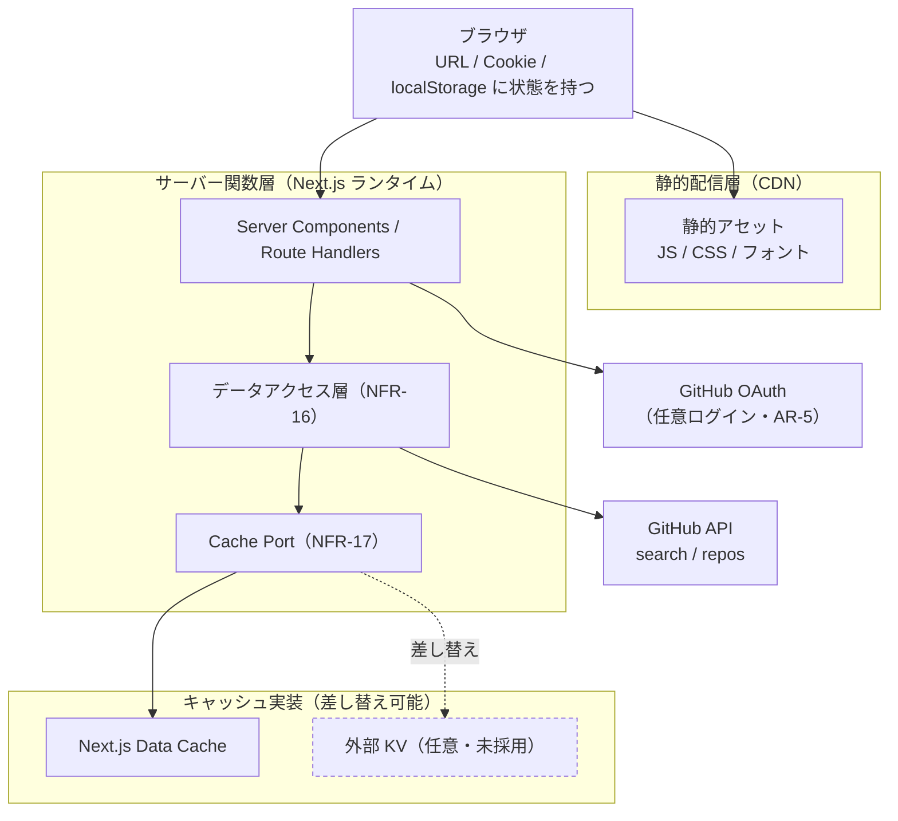

# gem-hunter インフラ設計（事業者非依存）

- **版**: 1.0
- **作成日**: 2026-08-18 JST
- **位置づけ**: **インフラに求める「契約」の正本**。デプロイ先・キャッシュ基盤の事業者を **決めないまま** 設計を確定させ、決めるときに迷わない状態にする
- **根拠となる決定**: `D-5` / `D-7`（インフラ未決）/ `D-11`（プレビュー環境のみ先行決定）/ `D-13`〜`D-15`（本書の執筆にあたって確定・[`open-questions.md`](../../02_requirements/open-questions.md) §6）

---

## 0. このドキュメントについて

### 0.1. なぜ「決めずに」設計するのか

インフラを決めないことは先送りではない。**決めないまま進めても壊れない構造** を先に確定させておくと、選定は後からいつでも、しかも安く行える。逆に選定を先に済ませてしまうと、その事業者の都合がアプリコードへ静かに染み出し、乗り換えが「移行プロジェクト」に化ける。

本書のゴールは 1 つだけ:

> 🔴 **事業者を差し替えるとき、`app/` 配下のアプリケーションコードを 1 行も書き換えなくてよい状態を保つ。**

書き換えが必要になった時点で `NFR-21` 違反であり、ADR を起票して構造を直す。

### 0.2. 正本としての責務範囲

本書が正本として保持するのは **インフラに求める契約 / 個人情報の取り扱い規定 / 環境構成 / 事業者選定の評価軸** である。以下は他ドキュメントが正本を持ち、本書は ID で参照する（同じ事実を 2 箇所に書かない）。

| 情報 | 正本 |
|---|---|
| 要件 ID・受け入れ条件・優先度 | [`prd.md`](../../02_requirements/prd.md) |
| 各決定の理由・経緯 | [`open-questions.md`](../../02_requirements/open-questions.md) の決定ログ（`D-n` / `Q-n`） |
| 状態の置き場所（URL / Cookie / `localStorage`） | [`prd.md`](../../02_requirements/prd.md) §2.4 |
| 環境変数の一覧 | [`prd.md`](../../02_requirements/prd.md) §10 |
| キャッシュ TTL の具体値 | [`prd.md`](../../02_requirements/prd.md) §13（未決・`SP-5` で暫定値を置く） |
| 技術的意思決定の詳細 | [`docs/adr/`](../../adr) |
| UI 実装の判断基準 | [UI/UX ガイドライン](../ui-ux/ui-ux-guidelines.md) |

### 0.3. ID 体系

本書は **`INF-n`**（Infrastructure）を用いる。要件そのものではなく **「インフラ側が満たすべき契約項目」** に振る ID であり、要件 ID（`FR-n` / `NFR-n` 等）を置き換えるものではない。

🔴 **一度振った ID は変更・再利用しない**（欠番が出ても詰めない）。

### 0.4. 本書の前提となるユーザー決定

| # | 期待値 | 本書での扱い |
|---|---|---|
| 1 | サーバー側に極力ユーザー情報などの個人情報を保持しない | `INF-1` として原則化し、§5 で「何を記録しないか」まで具体化する |
| 2 | コストを最小に抑えたい | `INF-2` として原則化し、§10 でコストドライバと打ち手に落とす |
| 3 | 最低限求められている技術スタックに合わせた構成にしたい | `INF-3` として原則化する（`TR-1`〜`TR-4` から逸脱しない） |
| 4 | 運用の手離れを重視したい | `INF-4` として原則化し、§9 で「人手の定常作業ゼロ」の構成に落とす |

あわせて、実行モデルは **サーバーレス関数前提**（`D-13`）、ログは **アプリ側では一切記録しない**（`D-14`）を採る。

---

## 1. 設計を貫く 5 原則

| ID | 原則 | 破っていないことの判定方法 |
|---|---|---|
| **INF-1** | **サーバー側に個人情報を保持しない** | サーバーに永続ストアが存在しない。アプリのログ出力に §5.3 の禁止項目が 1 つも含まれない |
| **INF-2** | **定常コストをゼロに近づける** | 無課金の前提で運用でき、超過時は課金ではなく停止側に倒れる設定になっている（§10） |
| **INF-3** | **与件の技術スタックから逸脱しない** | Next.js 標準機能（App Router / Server Components / キャッシュ機構）の範囲で構成が閉じている（`TR-1`〜`TR-4`） |
| **INF-4** | **人手の定常運用をゼロにする** | 定期的に人が行う作業が §9.4 の一覧のみで、そのすべてに自動化または自動起票の手当てがある |
| **INF-5** | **事業者を決め打たない** | §3.2 の禁止リストに該当する記述がアプリコードに存在しない（`NFR-21`） |

⚠️ **原則同士が衝突したときの優先順位**: `INF-1` > `INF-3` > `INF-5` > `INF-2` > `INF-4`。個人情報を持たないことと与件充足は譲れず、コストと手離れは構成の工夫で吸収する。

---

## 2. 論理構成

事業者名を持たない、論理コンポーネントだけの構成図。



🔴 **この図に「データベース」が存在しないことが本設計の核心** である（`D-5` 追補）。サーバー側は **リクエストを処理して捨てる** だけで、次のリクエストへ持ち越す状態を持たない。

---

## 3. ランタイム契約（インフラに求める最低条件）

### 3.1. 満たしていれば採用できる条件

事業者がこの 9 項目を満たすなら、本アプリはそこで動く。逆に **これ以上のことをインフラに要求しない**。

| ID | 契約項目 | 理由・紐づく要件 |
|---|---|---|
| **INF-6** | `next build` の出力を **Node.js 互換ランタイム** で実行できる（Web 標準の `fetch` / `Request` / `Response` / Web Crypto が使える） | `TR-1` / `TR-2`。セッション Cookie の暗号化に Web Crypto を使う（`AR-5`） |
| **INF-7** | リクエスト単位でサーバー実行できる（Server Components / Route Handlers が動く） | `FR-5`（URL 直アクセス可能な詳細ページ）/ `NFR-9`（トークンをサーバー側に留める） |
| **INF-8** | **レスポンスストリーミング** に対応する（Suspense によるストリーミング SSR） | `NFR-1`（LCP 2.5 秒以下）。GitHub API の待ち時間を体感から隠す唯一の手段 |
| **INF-9** | 環境変数を **ランタイムに注入** できる（ビルド時埋め込みを強制されない） | `NFR-22`。シークレット更新のたびに再ビルドさせない（`INF-4`） |
| **INF-10** | 静的アセットを CDN から配信でき、`immutable` なキャッシュヘッダを付けられる | `NFR-1` / §10 の帯域コスト |
| **INF-11** | 画像を配信できる（`next/image` の最適化が動く、**または** 最適化を無効化しても `NFR-6` を満たせる） | `NFR-6` / `NFR-1` の CLS。§14 に未決事項として残す |
| **INF-12** | 1 リクエストを **10 秒以内** に完結できる（タイムアウト上限がこれを下回らない） | GitHub API を直列 2 回呼ぶ最悪ケースの想定（`NFR-7` の直列化） |
| **INF-13** | **永続ディスクを前提にしない**（書き込みは一時領域のみ、再起動で消えてよい） | `D-5` 追補（DB を持たない）。サーバーレス前提（`D-13`）では保証されない |
| **INF-14** | **単一リージョンで成立する**（マルチリージョン前提の機能を使わない） | `INF-2`。冗長構成はコストに直結し、MVP の可用性要件を超える |

### 3.2. アプリコードに持ち込まない（`INF-5` の実装形）

`NFR-21` を「判定できる禁止リスト」に落としたもの。**セルフレビューでこの表を機械的に当てる**。

| # | 禁止 | 代わりに |
|---|---|---|
| 1 | 事業者固有の SDK・グローバル変数・ランタイム API の直接呼び出し | Next.js 標準 API のみを使う |
| 2 | プロセス内メモリ・ローカルファイルへの **リクエストをまたぐ** 状態保存 | Cache Port 越しに保存する（§6）。そもそもサーバーレスでは効かない |
| 3 | 事業者固有の KV / オブジェクトストレージへの直接アクセス | Cache Port の実装として **1 箇所に閉じ込める**（`NFR-17`） |
| 4 | cron / キュー / 常駐ワーカーへの依存 | MVP では使わない。必要になったら ADR を起票する（Phase 2 の論点） |
| 5 | 事業者固有のリライト・リダイレクト設定に依存したルーティング | `next.config` とファイルシステムルーティングで表現する |
| 6 | プレビュー環境固有の API・環境変数をアプリの分岐条件にする | 環境差は **環境変数の値** だけで表現する（`D-11` の但し書き） |

---

## 4. サーバーレス関数前提から従属的に確定すること（`D-13`）

実行モデルをサーバーレス関数に置いた（`D-13`）ことで、以下が **設計の前提として自動的に決まる**。ここを読み落とすと後で作り直しになる。

| # | 帰結 | 対応 |
|---|---|---|
| 1 | 🔴 **プロセス内メモリのキャッシュが当てにできない**（インスタンスが使い捨て・複数並存） | `NFR-17` の Cache Port は「あると便利」から **「無いと成立しない」に格上げ** される（§6） |
| 2 | 🔴 **request coalescing（同時同一クエリの合流・`NFR-7`）はインスタンス内でしか効かない** | 効果を過大評価しない。レート制限対策の主役は **キャッシュヒット率** であり、coalescing は補助と位置づける |
| 3 | コールドスタートが発生する | 依存を軽く保つ（`NFR-3` のバンドル方針と同じ方向）。`NFR-1` の計測は本番相当環境で行う（`NFR-27`） |
| 4 | 課金の単位が **実行時間 × 実行回数** になる | キャッシュヒットは体感速度だけでなく **コストを直接下げる**（§10） |
| 5 | 同時実行数が自動でスケールする | 素通しすると GitHub API のレート枠（30 req/分）を一瞬で焼き切る。**キャッシュが唯一の防波堤** になる |
| 6 | ローカル開発環境（`next dev`）と挙動が乖離しうる | 動作確認はプレビュー環境で行う（`SD-1`）。ローカルで通ったことを完了条件にしない |

> ⚠️ **`INF-5` との関係**: サーバーレスを前提にしても事業者は縛られない。Next.js 16.2 で **Adapter API が stable 化**（2026-03）し、Vercel / Bun の検証済みアダプタに加えて Cloudflare / Netlify / AWS 向けが開発中である（[Next.js 公式](https://nextjs.org/blog/nextjs-across-platforms) / [OpenNext](https://opennext.js.org/)）。現時点（2026-08）で移植に使える手段は **OpenNext** と **standalone 出力 + コンテナ** の 2 つで、公式アダプタは選定時に GA 状況を再確認する。

---

## 5. データと個人情報（`INF-1` の具体化）

### 5.1. どこに何が置かれるか

配置そのものの正本は [`prd.md`](../../02_requirements/prd.md) §2.4。ここでは **インフラから見て「サーバーに何が残るか」** だけを示す。

| データ | 置き場所 | サーバーに残るか |
|---|---|---|
| 検索キーワード・ページ・ソート・件数・ロケール | URL | ❌ 残らない（リクエストとともに消える） |
| OAuth アクセストークン | 暗号化 httpOnly Cookie（ブラウザ保持） | ❌ 残らない（サーバーは復号して使い、捨てる） |
| お気に入り・検索履歴・UI 設定 | `localStorage`（ブラウザ保持） | ❌ 残らない（サーバーへ送信しない） |
| GitHub API のレスポンス | キャッシュ層 | ⚠️ 一時的に残る。ただし **公開情報のみ**（§5.4） |
| 利用者の識別子・行動履歴 | **どこにも作らない** | ❌ 存在しない |

🔵 **この構造の帰結**: 利用者からの削除要求に対して、サーバー側で行う作業が **存在しない**（ブラウザの Cookie と `localStorage` を消せば完結する）。この性質は README に明記する（`NFR-30`）。

### 5.2. サーバー側に置いてよいもの / 置かないもの

| 区分 | 内容 |
|---|---|
| ✅ 置いてよい | アプリの実行に必要なシークレット（§7）/ GitHub の **公開** リポジトリ情報のキャッシュ / ビルド成果物 |
| ❌ 置かない | 利用者の識別子・プロフィール・メールアドレス / 検索キーワードの記録 / 閲覧履歴 / IP アドレス・User-Agent の記録 / OAuth トークンの保存 |

### 5.3. ログ規定（`D-14`）

🔴 **アプリケーションからは、個人と結びつきうる情報を一切出力しない。**

| 区分 | 項目 |
|---|---|
| ✅ 出力してよい | エラー種別コード（[`prd.md`](../../02_requirements/prd.md) §7 の判別結果）/ HTTP ステータスコード / `x-ratelimit-remaining` の残量値 / 処理時間 |
| ❌ 出力しない | IP アドレス / User-Agent / Cookie の内容 / 検索キーワード / リポジトリ名を含む閲覧対象 / OAuth トークン（一部でも） / GitHub ユーザー名・ユーザー ID / スタックトレースに載った上記のいずれか |

- **例外なく適用する**。デバッグ目的の一時的な出力も、コミットに含めない。
- エラー報告は **種別コードのみ** で行う。「誰が何を検索して失敗したか」は再現手順として受け取らない（利用者に再現手順を尋ねるのは可）。
- ⚠️ **事業者標準のアクセスログ（HTTP ログ）はアプリの制御外にある**。これは「持たない」と言い切れない唯一の領域なので、§11 の評価軸に **保持期間・無効化可否・データ所在地** を明示的に含める。

### 5.4. キャッシュに個人情報を混ぜない

- キャッシュキーは **検索条件（キーワード / ページ / ソート / 件数）** と **`owner/repo`** のみで構成する（`NFR-18`）。利用者識別子を含めない。
- 🔴 **結果としてキャッシュは全利用者で共有される**。これは効率のためだけでなく、「キーから誰の検索か復元できない」ことの担保でもある。
- ⚠️ **ログイン利用者向けの応答をキャッシュに混入させない**。ログインで変わるのはレート枠だけで表示内容は同一（`AR-5`）だが、将来ログイン限定表示を足すなら **その時点でキャッシュ設計を見直す**（キーに識別子を足すのではなく、キャッシュ対象から外す方向で解く）。

### 5.5. 第三者への送信

- MVP では **アナリティクス・エラートラッキング SaaS を導入しない**。導入は「サーバーに持たない」を最も簡単に破る経路であるため、ADR なしに入れない。
- 導入を検討する場合の最低条件: 個人識別子を送らない設定が可能であること / IP 匿名化が既定であること / 送信内容を §5.3 の許可リストに限定できること。

---

## 6. キャッシュ配置（Cache Port の運用契約）

### 6.1. 3 層構成

| 層 | 実装 | 生存範囲 | MVP での採否 |
|---|---|---|---|
| **L1** | リクエスト内メモ化（React `cache` 等） | 1 リクエスト | ✅ 採用。同一レンダー内の重複呼び出しを消す |
| **L2** | Next.js のデータキャッシュ | 事業者依存（インスタンス / 事業者のキャッシュ基盤） | ✅ 採用。MVP の主役 |
| **L3** | 外部 KV | 全インスタンス共有・永続的 | ❌ 未採用（`D-5`）。Cache Port の実装差し替えだけで入れられる状態に保つ |

- **Cache Port の面積は `get` / `set` / `invalidate` + TTL に限定する**（`NFR-17`）。汎用キャッシュライブラリを自作しない。
- キー命名規約は `NFR-18` に従い、**検索結果** と **単一リポジトリ** で名前空間を分ける。

### 6.2. L3（外部 KV）を入れる判定条件

「なんとなく不安だから」で入れない。以下のいずれかを **観測** したときに初めて検討し、ADR を起票する。

1. レート制限起因のエラー（[`prd.md`](../../02_requirements/prd.md) §7 の該当種別）が実利用で発生した
2. キャッシュヒット率が想定を下回り、`INF-2`（コスト）または `NFR-7`（レート制限耐性）を満たせない
3. Phase 2 の静的データ配信（`GR-5`）で、配信物の置き場所が必要になった

---

## 7. シークレットの取り扱い

| ID | 契約項目 |
|---|---|
| **INF-15** | シークレットは **環境変数としてのみ** 注入する。リポジトリ・ビルド成果物・クライアントバンドルに含めない（`NFR-9` / `NFR-22`） |
| **INF-16** | `NEXT_PUBLIC_` 接頭辞を付けない（[`prd.md`](../../02_requirements/prd.md) §10） |
| **INF-17** | **プレビュー環境と本番環境でシークレットを共有しない**（別の PAT・別の OAuth App を使う）。プレビュー URL は PR ごとに変わり、第三者の目に触れうるため |
| **INF-18** | ローテーションが **再ビルドなしで反映** できる（`INF-9` と対）。反映に再ビルドが要る事業者は `INF-4` の観点で減点する |
| **INF-19** | ローカル開発は `.env.local` を用い、コミットしない |

環境変数の一覧そのものは [`prd.md`](../../02_requirements/prd.md) §10 が正本。本書では再掲しない。

---

## 8. 環境構成

| 環境 | 用途 | シークレット | URL の安定性 | 誰が見るか |
|---|---|---|---|---|
| **local** | 開発 | `.env.local`（開発者個人の PAT） | `localhost` 固定 | 開発者のみ |
| **preview** | スプリントの動作確認（`SD-1`） | プレビュー専用の PAT / OAuth App | 🔴 **PR ごとに変わる** | PR を見る人（実質公開） |
| **production** | 公開運用 | 本番の PAT / OAuth App | 固定 | 第三者 |

### 8.1. 🔴 プレビュー環境と OAuth の相性問題（先に潰しておく）

OAuth のコールバック URL は **事前登録が必要** だが、プレビュー URL は PR ごとに変わる。放置すると「プレビューではログインだけ試せない」という穴が毎スプリント再発する。

**採る方針**（実装時に (a) を第一候補とする）:

- **(a) プレビューでは OAuth を無効化する** — 環境変数を未設定にすれば、`AR-5` の設計上「ログイン導線が出ないだけで全機能が使える」状態になる。未ログインでも全機能が使えるという `AR-5` の性質がそのまま逃げ道になる
- **(b) プレビュー用に固定のエイリアス URL を 1 つ確保し、そこだけ OAuth を有効化する** — 事業者がエイリアス機能を持つ場合のみ

⚠️ いずれの場合も **アプリコードに環境判定を書かない**（`INF-5` の禁止 6）。「OAuth 関連の環境変数が揃っているか」だけで分岐する。

> 🔴 **この方針の帰結** として、`SP-8`（ログイン）の E2E・操作レビューはプレビュー URL ではなく **ダミー OAuth 設定を注入したローカルビルド** に対して実行する。プレビューにはログイン導線自体が存在せず、ネットワークモックでは代替できないため（`docs/02_requirements/user-story-map.md` §8）。

### 8.2. 昇格フロー

```
作業ブランチへ push → preview 自動デプロイ → PR に URL を貼る（SD-1）
    → セルフレビュー → main へ squash マージ → production 自動デプロイ
```

`main` への直接 push は行わない（`A-1`）。**production への反映トリガーは `main` へのマージのみ** とし、手動デプロイの経路を作らない（`INF-4`）。

---

## 9. 運用の手離れ（`INF-4` の具体化）

### 9.1. デプロイ

| ID | 契約項目 |
|---|---|
| **INF-20** | デプロイのトリガーは **git push / マージのみ**。手作業のコマンド実行を運用手順に含めない |
| **INF-21** | 直前の正常ビルドへ **数手でロールバック** できる（事業者選定の評価軸・§11） |
| **INF-22** | ビルド失敗・デプロイ失敗が **通知される**（事業者標準の通知か CI の失敗通知で足りる。専用の監視基盤を建てない） |

### 9.2. 自己復旧

サーバーレス前提（`D-13`）では **インスタンスの異常はリクエスト単位で消える** ため、プロセス監視・再起動の運用が発生しない。これが `INF-4` に最も効いている。

外部要因（GitHub API 障害・レート枠枯渇）は **アプリ側で degraded 表示に落として自動回復する**（`NFR-7` / `NFR-8`）。人が介入して復旧させる設計にしない。

### 9.3. 監視の最小構成（`INF-1` を破らない範囲）

| 対象 | 手段 | 個人情報 |
|---|---|---|
| 稼働 | 外部からの外形監視（認証不要・応答が個人情報を含まないエンドポイント） | 含まない |
| レート枠 | `x-ratelimit-remaining` を **その場の表示判断にのみ** 使う | 含まない・保存しない |
| デプロイ / CI | 事業者標準の通知 + GitHub Actions の失敗通知 | 含まない |

🔴 **利用者の行動を可視化するダッシュボードは作らない**（`INF-1`）。運用に必要なのは「動いているか」であって「誰が何をしたか」ではない。

### 9.4. それでも人手が残る作業（ゼロにする対象）

| 作業 | 発生頻度 | 手当て |
|---|---|---|
| PAT の有効期限更新 | 期限依存 | 期限切れ前に **Issue を自動起票** する。または無期限トークンの可否を選定時に判断する |
| 依存パッケージの更新 | 継続 | 自動 PR（Dependabot / Renovate 相当）+ CI 緑での自動マージ |
| 無料枠の消費状況の確認 | 月次 | 上限超過時に **課金ではなく停止** に倒す設定で代替する（§10.3）。⚠️ 課金設定の変更自体は `A-6`（ユーザー作業） |

> 🔴 **この表が増えたら `INF-4` の劣化である。** 増やす変更には自動化の手当てを同時に付ける。

---

## 10. コスト設計（`INF-2` の具体化）

### 10.1. コストドライバ

| # | ドライバ | 効くもの |
|---|---|---|
| 1 | サーバー関数の **実行時間 × 実行回数** | サーバーレス前提での主コスト（`D-13`） |
| 2 | 帯域（静的アセット・画像） | 初回訪問数に比例 |
| 3 | ビルド時間・ビルド回数 | PR ごとのプレビュー生成で増える |
| 4 | 画像最適化の処理 | `next/image` の最適化は関数実行コストになりうる（`INF-11`） |
| 5 | 外部 KV | 未採用のため現時点でゼロ（§6.2） |

### 10.2. 打ち手（すべて既存要件と一致する）

| 打ち手 | 効くドライバ | 紐づく要件 |
|---|---|---|
| キャッシュヒット率を上げる | 1 | `NFR-5` / `NFR-7`。**コスト削減とレート制限対策が同じ打ち手** である点が重要 |
| Server Components を基本にする | 1・2 | `NFR-3` |
| 入力のたびに API を呼ばない | 1 | `NFR-4` |
| ページネーションを採る（無限スクロールではない） | 1 | `FR-7`。呼び出し回数が利用者のスクロール量に引きずられない |
| 表示件数の選択肢を 20 / 50 / 100 に固定する | 1 | `AR-3`。キャッシュキーの組み合わせ爆発を防ぎヒット率を保つ |
| 静的アセットに `immutable` を付ける | 2 | `INF-10` |
| オーナーアイコンの配信方式を選ぶ | 2・4 | `NFR-6` / `INF-11`。§14 の未決事項 |

### 10.3. 上限の張り方

- 🔴 **無料枠を超えたときに「課金される」ではなく「止まる」設定を優先する**。ポートフォリオ用途（`D-3`）で青天井の課金リスクを負わない。
- この挙動は事業者によって既定が異なるため、§11 の評価軸に含める。
- ⚠️ **課金・上限設定の変更はユーザーのアカウント権限が必要**（`A-6`）。Claude 側では構成の提案と設定手順の提示までを行う。

---

## 11. 事業者選定の評価軸（決定は保留）

選定時にこの表を上から埋める。**埋まらない軸があるなら、まだ選定してはいけない。**

| # | 評価軸 | なぜ効くか | 確認方法 |
|---|---|---|---|
| 1 | Next.js 16 のサポート方式（公式アダプタ / OpenNext / standalone） | `TR-1` / `INF-6`。ここが崩れると他の軸が無意味になる | 事業者の公式ドキュメントと [OpenNext](https://opennext.js.org/) の対応状況 |
| 2 | **無料枠の性質**（超過時に停止するか課金されるか） | `INF-2` / §10.3 | 料金ページの一次情報 |
| 3 | サーバー関数の実行モデル（Node 互換度・実行時間上限・ストリーミング可否） | `INF-6` / `INF-8` / `INF-12` | ランタイム仕様ページ |
| 4 | プレビューデプロイの有無と URL 形式（固定エイリアスの可否） | `D-11` / `SD-1` / §8.1 | 機能ページ |
| 5 | 環境変数のランタイム注入とローテーション時の再ビルド要否 | `INF-9` / `INF-18` | 環境変数ドキュメント |
| 6 | **アクセスログの保持期間・無効化可否・データ所在地** | `INF-1` / §5.3。アプリ制御外の唯一の領域 | プライバシー / ログのドキュメント |
| 7 | ロールバックの手数 | `INF-21` | デプロイ管理ページ |
| 8 | **退避コスト**（他へ移すときに書き換えるもの） | `INF-5`。ゼロに近いほど良い | §13 のチェックリストを当てる |
| 9 | 独自ドメイン・TLS の扱い | `M-4`（公開判断ゲート）で必要になる | ドメイン設定ドキュメント |
| 10 | キャッシュ層の提供有無（L3 を後から足せるか） | §6.2 | KV / ストレージ製品の有無 |

---

## 12. 付録 A: 候補アーキタイプの比較

🔴 **本表は「型」の比較であり、個別サービスの数値（無料枠の量・価格）の正本ではない**。数値は変動するため、選定時に §11 の手順で一次情報を確認する。ここでの目的は **どの型を軸に据えるかを先に決められる状態にすること** である。

| 型 | 例 | `INF-6` 適合 | `INF-5` リスク | プレビュー | 退避コスト | `INF-4` 手離れ |
|---|---|---|---|---|---|---|
| **A. Next.js ネイティブ PaaS** | Vercel 等 | ◎ 最も確実 | △ 固有機能が便利すぎて染み出しやすい | ◎ 標準機能 | △ 固有機能を使った分だけ増える | ◎ |
| **B. エッジランタイム系** | Cloudflare Workers + OpenNext 等 | ○ アダプタ経由。Node 互換に制約が残る | ○ アダプタが吸収する | ○ | ○ | ○ |
| **C. 汎用 PaaS のサーバーレス / コンテナ** | Netlify・Render・Cloud Run 等 | ○ standalone 出力で成立 | ◎ 標準構成に閉じやすい | 事業者による | ◎ コンテナごと移せる | ○ |
| **D. 自前 IaaS** | VPS + Docker | ◎ 制約なし | ◎ ロックインなし | ✗ 自前構築が必要 | ◎ | ✗ **OS 更新・証明書・監視が人手に戻る** |

**現時点の読み**（決定ではない）:

- **D は `INF-4`（手離れ）と `INF-2`（コスト）の両方で不利** なため、本プロジェクトの前提では優先度が低い。
- **A は最短で `SD-1` を満たせる** 一方、`INF-5` の維持を意識的に行う必要がある（§3.2 の禁止リストが効くのはまさにこの型）。
- **B / C は退避コストが小さい** が、`INF-6` の適合をアダプタの成熟度に依存する（§4 の但し書き）。
- **プレビュー環境（`D-11`）と本番（`D-7`）で別の型を選んでもよい**。`INF-5` を守れていれば、両者を揃える必然性はない。

---

## 13. 移行手順（事業者を差し替えるときに触る箇所）

差し替え時のチェックリスト。**アプリケーションコードがこの表に現れないことが `INF-5` の合格条件** である。

- [ ] 環境変数を新しい事業者へ再設定する（[`prd.md`](../../02_requirements/prd.md) §10 の一覧）
- [ ] OAuth のコールバック URL を更新する（GitHub OAuth App 側 + 環境変数）
- [ ] 独自ドメインを使っている場合は DNS を切り替える
- [ ] Cache Port の実装を差し替える（差し替えるのは **実装ファイルのみ**・`NFR-17`）
- [ ] プレビュー URL の生成方法を CI / PR テンプレートに反映する
- [ ] README のデプロイ手順を更新する（`NFR-29`）
- [ ] ⚠️ **上記以外に書き換えが必要になったら `NFR-21` 違反**。ADR を起票し、構造を直してから移行する

---

## 14. 未決事項と決定タイミング

🔴 **決めたつもりにしない。** 以下は現時点で根拠を持って決められないため、意図的に開いてある。

| 項目 | 決定に必要なもの | 決定タイミング | 関連 |
|---|---|---|---|
| **プレビュー環境の事業者** | §11 の評価軸のうち 1・3・4 | `M-1`（`SP-1`） | `D-11` |
| **本番環境の事業者** | §11 の全軸 | `M-4`（公開判断ゲート） | `D-7` |
| 画像（オーナーアイコン）の配信方式 | `next/image` の最適化コストと `NFR-6` の両立可否の実測 | `M-1`〜`M-2` | `INF-11` / `NFR-6` |
| 外部 KV（L3）の採否 | §6.2 の判定条件の観測 | 条件を満たしたとき | `NFR-17` |
| **コスト上限の実額**（撤退ライン） | ユーザーの許容額 | 本番事業者の選定時（`M-4`） | `INF-2` / `A-6` |
| 独自ドメインの要否 | 第三者公開の判断 | `M-4` | `INF-1` の §11 軸 9 |
| アクセスログの保持設定 | 事業者の提供オプション | 事業者選定と同時 | `INF-1` / §5.3 |

**選定が確定したら ADR を起票する**（`NFR-32`）。最低限、① なぜその事業者を選んだか ② §11 のどの軸で他候補を落としたか ③ `INF-5` を維持するために課した制約、を記録する。

あわせて、**選定と同じタイミングで §9.4 の自動化を実装 Issue として起票する**（PAT の期限切れ前の自動起票・依存更新の自動 PR）。対象が存在しない段階で先に作らないが、対象ができた時点で放置もしない（`INF-4`）。

---

## 15. 参照

| ドキュメント | 関係 |
|---|---|
| [`prd.md`](../../02_requirements/prd.md) | 要件の正本。本書は要件 ID を参照し受け入れ条件を再掲しない |
| [`open-questions.md`](../../02_requirements/open-questions.md) | 決定の理由・経緯の正本（`D-5` / `D-7` / `D-11` / `D-13`〜`D-15`） |
| [`roadmap.md`](../../02_requirements/roadmap.md) | `M-n` の正本。§14 の決定タイミングはここへ射影される |
| [`user-story-map.md`](../../02_requirements/user-story-map.md) | `SP-n` の正本 |
| [UI/UX ガイドライン](../ui-ux/ui-ux-guidelines.md) | UI 実装の判断基準（本書は UI に踏み込まない） |
| [Next.js 16 アーキテクチャリサーチ](../architecture/20260817-nextjs16-architecture-research.md) | アプリ内部構成の指針（本書はその外側を扱う） |
| [`docs/adr/`](../../adr) | 事業者選定が確定した時点の記録先 |
