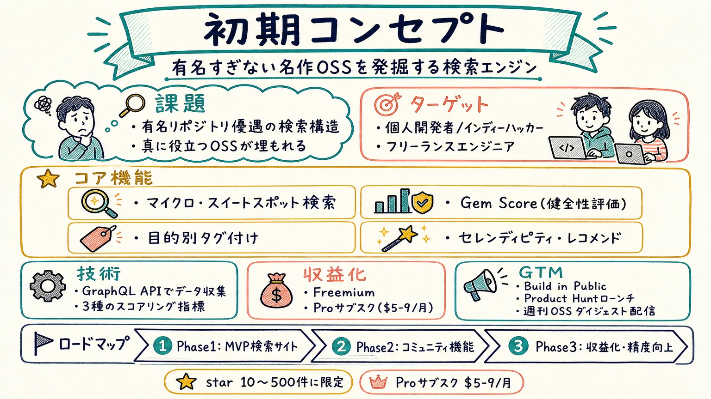
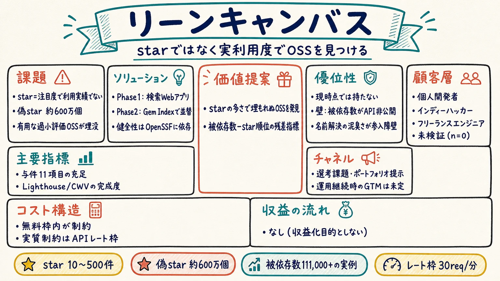
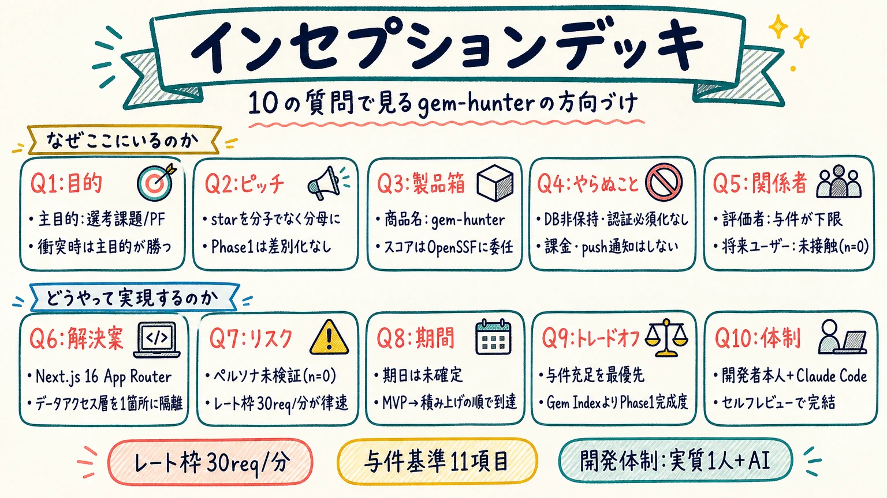
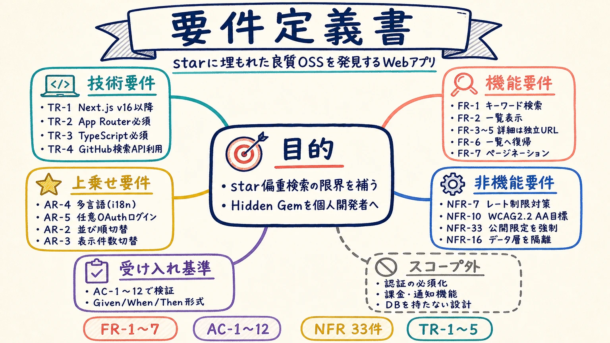
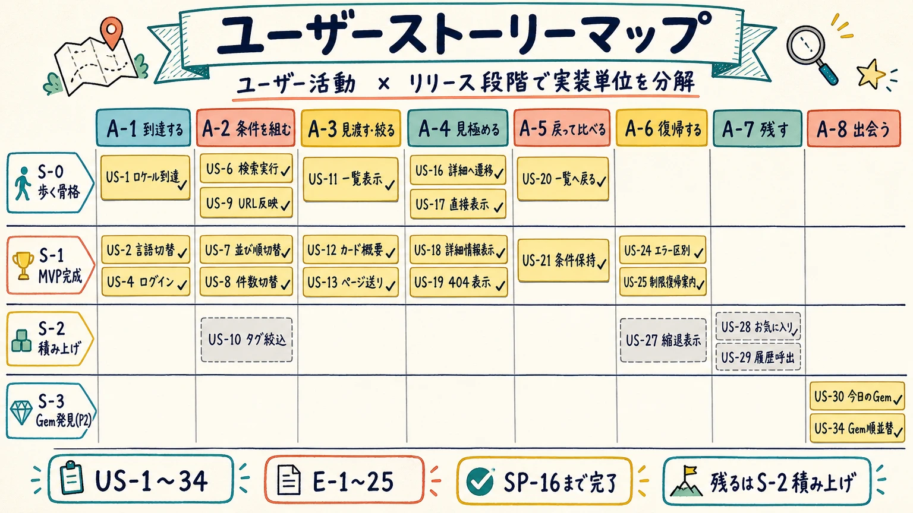
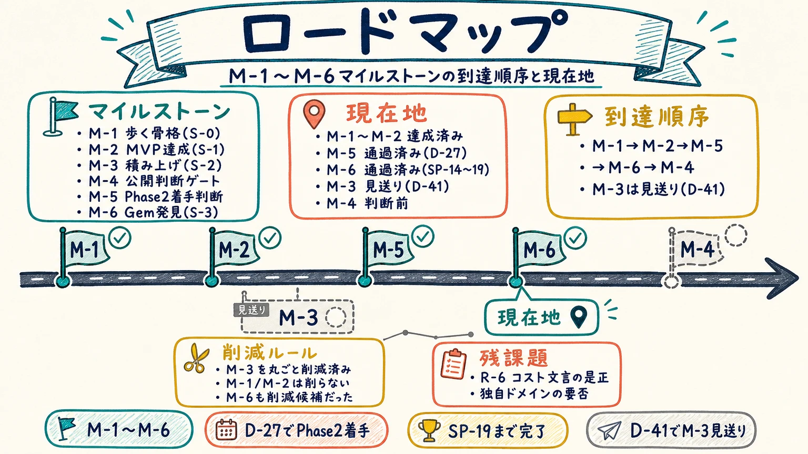
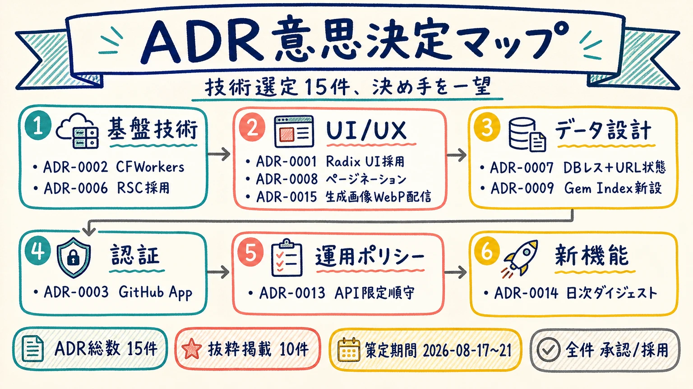
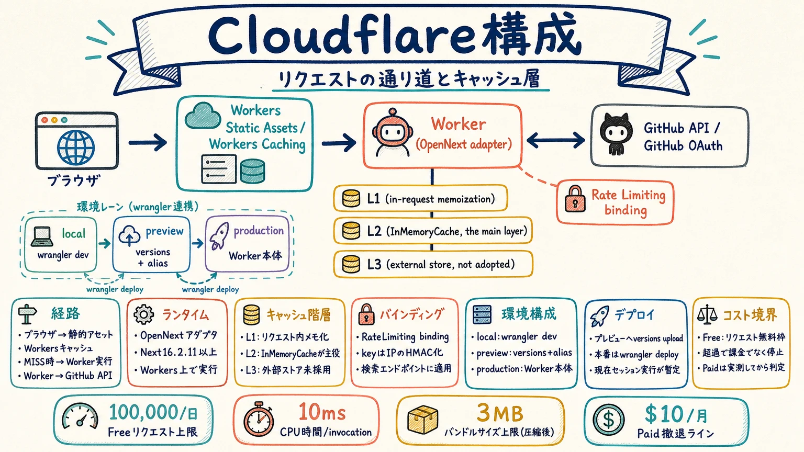
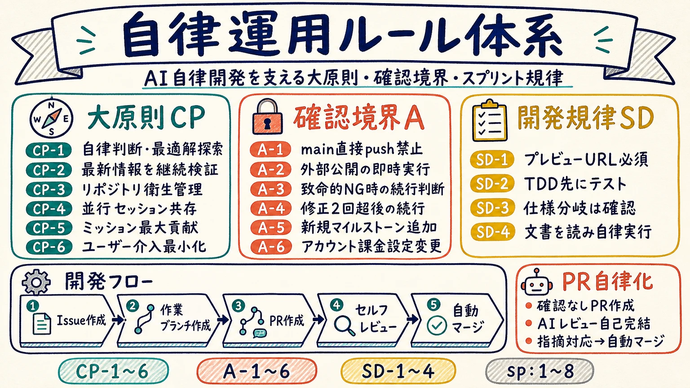
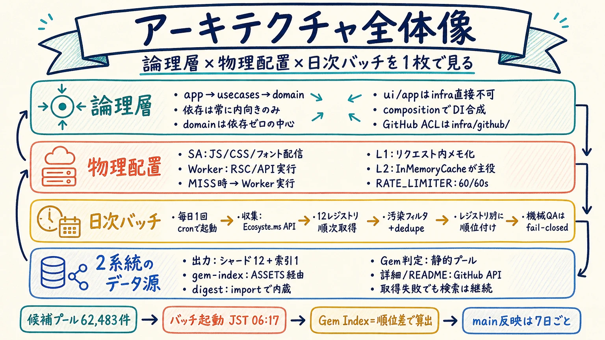

# インフォグラフィック（グラレコ風ドキュメント要約）

本プロジェクトの主要ドキュメントを、**16:9 のグラフィックレコーディング風インフォグラフィック** として要約したもの。
「1 枚見ればそのドキュメントの大枠が分かる」ことを目的とし、詳細は各画像から元ドキュメントを辿る。

> ⚠️ **画像は要約であって正本ではない。** 要件の正本は [`../02_requirements/prd.md`](../02_requirements/prd.md)、
> 決定の経緯は [`../02_requirements/open-questions.md`](../02_requirements/open-questions.md) が持つ。
> 元ドキュメントを更新したら、対応する画像も再生成する（手順は [`../../tools/infographic/README.md`](../../tools/infographic/README.md)）。

## コンセプト

### 1. 初期コンセプト

元ドキュメント: [`00_concept/initial-concept.md`](../00_concept/initial-concept.md)

### 2. リーンキャンバス

元ドキュメント: [`00_concept/lean-canvas.md`](../00_concept/lean-canvas.md)

### 3. インセプションデッキ

元ドキュメント: [`00_concept/inception-deck.md`](../00_concept/inception-deck.md)

## 要件定義

### 4. 要件定義書（PRD）

元ドキュメント: [`02_requirements/prd.md`](../02_requirements/prd.md)

### 5. ユーザーストーリーマップ

元ドキュメント: [`02_requirements/user-story-map.md`](../02_requirements/user-story-map.md)

格子のセルは実際の `US-n` で埋めてあり、チェック付きが完了・点線グレーが未着手を表す。
該当ストーリーが無いセルは意図的に空白のままにしている。

### 6. ロードマップ

元ドキュメント: [`02_requirements/roadmap.md`](../02_requirements/roadmap.md)

## 設計

### 7. デザイン設計

元ドキュメント: [アプリケーションアーキテクチャ](../03_design/architecture/application-architecture.md) /
[ドメインモデル](../03_design/data-model/domain-model.md) /
[UI/UX ガイドライン](../03_design/ui-ux/ui-ux-guidelines.md) /
[インフラ設計](../03_design/infrastructure/infrastructure-design.md)

### 8. 各ドキュメントの関連性

元ドキュメント: [`docs/README.md`](../README.md)

どのドキュメントがどのドキュメントの入力になるかを表す。ADR と運用ルールは全フェーズを下支えする位置づけ。

## 技術・運用

### 9. ADR 意思決定マップ

元ドキュメント: [`adr/`](../adr)

### 10. Gem Score 算出ロジック

元ドキュメント: [`adr/0009-hidden-gem-score-definition.md`](../adr/0009-hidden-gem-score-definition.md)

### 11. テスト戦略

元ドキュメント: [`04_development/testing-strategy.md`](../04_development/testing-strategy.md)

### 12. Cloudflare 構成

元ドキュメント: [`03_design/infrastructure/cloudflare-infrastructure.md`](../03_design/infrastructure/cloudflare-infrastructure.md)

### 13. 自律運用ルール体系

元ドキュメント: [`CLAUDE.md`](../../CLAUDE.md) / [`rules/core-principles.md`](../rules/core-principles.md) /
[`rules/user-confirmation-minimization.md`](../rules/user-confirmation-minimization.md) /
[`rules/sprint-development-rules.md`](../rules/sprint-development-rules.md)

## 全体像

### 14. アーキテクチャ全体像

元ドキュメント: [アプリケーションアーキテクチャ](../03_design/architecture/application-architecture.md) /
[Cloudflare インフラ設計](../03_design/infrastructure/cloudflare-infrastructure.md) /
[`.github/workflows/gem-pool-refresh.yml`](../../.github/workflows/gem-pool-refresh.yml) /
[`tools/gem-pool/`](../../tools/gem-pool)

7 の「設計サマリー」が箇条書きで示す層構造と、12 の「Cloudflare 構成」が示す実行時の経路に対して、
本図は **Gem 候補プールの日次バッチ** と **2 系統のデータ源**（静的シャードと GitHub API）を加えて
1 枚に統合する。層の依存が内向きだけであることも図中の矢印で示す。

## 仕様

| 項目 | 値 |
|---|---|
| モデル | OpenAI `gpt-image-2` |
| 生成サイズ | 1536 × 864（完全な 16:9。幅・高さとも 16 の倍数であることが API の必須条件） |
| 品質 | `medium` |
| 格納形式 | WebP（quality 90）。元の PNG は 1 枚 約 2MB のためリポジトリには入れない |
| 配色 | ネイビー / ティール / コーラル / マスタード + 生成りの紙地 |
